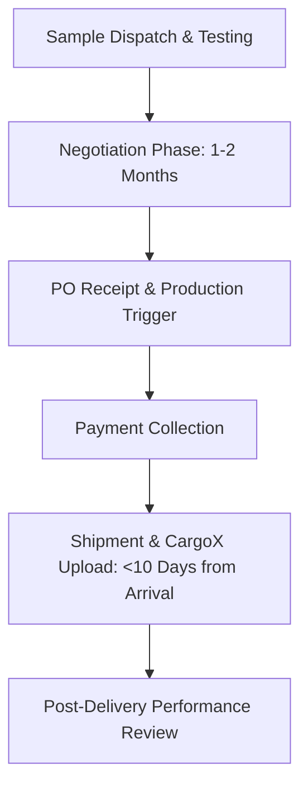

# Operational Documentation: Business Development (Cocopeat)

## Department Snapshot

### Time & Effort Split
* **Outbound Outreach & Lead Sourcing:** ~40% (estimated)
* **Lead Nurturing & Follow-ups:** ~25% (estimated)
* **Logistics & Documentation:** ~20% (estimated)
* **Cross-Department Coordination:** ~15% (estimated)
* **Rajesh Balu's Split:** Stated directly as **10%–20%** of KPI/effort allocated to BD; the remaining **80%–90%** (estimated) is allocated to logistics and product development.

### Tool Stack
* **Tracking & Pipelines:** Excel, Google Sheets (ad-hoc tracking spreadsheets)
* **Outbound & Internal Comms:** Email (Gmail), Slack (internal), WhatsApp (Middle East/UAE), WeChat (China), LINE (Japan)
* **Lead Generation & Ads:** Google Ads, LinkedIn Ads, Dripify (LinkedIn automation; subscription lapsed)
* **Compliance & Logistics:** CargoX (export document clearance)
* **Video Conferences:** Google Meet, Zoom, MS Teams

### Key Frequency & Volume Metrics
* **Outbound Email Volume:** **20–25** new emails/day per mailbox (stated directly)
* **Outreach Response Rate:** ~**5%** average (stated directly)
* **Negotiation Cycle:** **1–2 months** from sample check to PO (stated directly)
* **Import Permitting SLA (Egypt/Peru/Spain):** **20–25 days** (stated directly)
* **CargoX Upload Window:** Within **10 days** of container arrival (stated directly)
* **Ad Lead Response Latency:** **6–10 hours** delay due to time zone differences (stated directly)
* **Target D2C Launch (Japan):** Within **3–4 months** (stated directly)

### Red Flags
1. **High**: *CargoX Gating Bottleneck* — Export document uploads must occur within 10 days of container arrival but are strictly gated behind Accounts payment clearance, risking demurrage fees.
2. **Medium**: *Ad-to-Lead Response Lag* — Response delays of 6–10 hours for inbound queries from paid Google/LinkedIn ads lead to lost high-intent opportunities.
3. **Medium**: *Email Deliverability Risk* — Cold outbound outreach (20–25 emails/day per mailbox) shares the same primary domain/inbox as internal and client-replies without warm-up tools, creating a domain blacklisting risk.
4. **Low**: *Disconnected Lead Pipelines* — Sourced leads, landing page inquiries, and LinkedIn messages are tracked in siloed, manual spreadsheets with no unified database.

---

## 1. Operational Profile & Scope
* **Department/Business Unit:** Business Development (Cocopeat) — a newer export-focused business line specializing in coconut husk-based soil-less growing media.
* **Core Products:** Cocopit (available as open-top grow bags, cocopit grow bags, 5kg blocks, and pellets/coins). Custom blends are formulated with perlite or NPK based on client specification (e.g., horticulture, cannabis growers).
* **Target Markets:** Primary export markets include the UK, Europe, and the Middle East. Direct-to-Consumer (D2C) website-based launch is scheduled for Japan within a timeline of **3–4 months** (stated directly).
* **Order Economics:**
  * Minimum Order Quantity (MOQ): 1 full container.
  * Container Capacities (stated directly):
    * 20ft Container: ~10–11 metric tons (10 pallets).
    * 40ft Container: ~20–22 metric tons.
    * 40ft High-Cube Container: ~25–27 metric tons.
  * Less-than-Container-Load (LCL) shipments are not offered due to freight cost economics.
  * Manufacturing is consolidated at a single production unit in Coimbatore, South India.

---

## 2. Team Structure & Effort Distribution

### Personnel Roles & KPIs
* **Mohit Kumar Gupta (BD Executive):** Leads the Japan business segment, manages direct Japanese client relationships, and coordinates internal/external communications with Ishwarya M, Rajesh Balu, and Yoshida-san.
* **Yoshida-san (BD Executive - Japan-based):** Coordinates Japan-specific pricing and manufacturer alignment.
* **Ishwarya M (BD Manager):** Manages end-to-end client relationships (outreach, lead nurturing, quotation, delivery, testing), handles logistics coordination, maintains documentation, and coordinates design approvals.
* **Rajesh Balu (BD Executive):** Spans logistics operations, product development support, and business development tasks.
* **Shared Daily KPIs:** New lead generation, existing lead nurturing, sample follow-ups, pricing coordination with manufacturers, and quotation generation.

---

## 3. Lead Generation & Outreach Workflow

### Sourcing & Qualification
1. **Manual Sourcing:** Contact details are gathered using Google search, AI tools, industry exhibition directories, company websites, and import/export databases.
2. **Prioritization Matrix:** Leads are qualified based on a sequential hierarchy: Designation → Country → Company size (applied based on data availability).
3. **Outreach Timing:** Sourcing and message delivery are structured according to target time zones (e.g., China outreach at 07:00 IST, UK/US outreach after 17:00 IST) (inferred effort: ~1–2 hours/day on timing alignment).

### Outreach Channels & Sequences
* **Outbound Email:**
  * **Volume:** **20–25** new outbound emails/day per mailbox (stated directly).
  * **Targeting:** Primarily generic inboxes (e.g., "info@") due to limited access to direct decision-maker contact details.
  * **Response Rate:** Stated directly as ~**5%** ("5 responses out of 100 leads" cited as the working average).
* **LinkedIn Outreach:**
  * Managed via a multi-touch follow-up sequence: Connection request → Case-study message → 3 to 4 sequential follow-up messages if no reply.
  * Uses automated sequences (previously via Dripify, though the subscription is currently lapsed).
* **Inbound Landing Page:**
  * Paid search/social campaigns (Google Ads, LinkedIn Ads) drive traffic to a landing page query form. Incoming queries are manually reviewed, highlighted in trackers, and followed up via WhatsApp or email.
* **Direct Messaging:**
  * WhatsApp is used for Middle East/UAE markets; WeChat is used for China; LINE is used for Japan.

---

## 4. Order Fulfillment & Shipment Process

### Typical Export Lifecycle
1. **Sample Verification:** BD dispatches samples for client verification. Technical parameters tested by clients include EC (electrical conductivity) levels, expansion rates, and volume output.
2. **Negotiation:** BD and client align on pricing, container volumes, and payment terms. Stated average duration: **1–2 months**.
3. **Production Trigger:** Production commences upon formal receipt of Purchase Order (PO).
4. **Payment Processing:** Payment collection is executed per negotiated terms (advance payment or balance against documents).
5. **Shipment & Delivery:** Container is booked, shipped, and followed up post-arrival for customer performance feedback.

### Country-Specific Regulatory Protocols (Egypt, Peru, Spain)
* **Import Permitting:** Customers must obtain a local import permit (e.g., ACID number in Egypt) by submitting a proforma invoice to their bank/embassy. Turnaround time: **20–25 days** (stated directly).
* **CargoX Upload window:** Shipping documents must be uploaded to the CargoX platform within **10 days** of container arrival at the port of destination (stated directly).
* **Finance Gating:** The CargoX upload is strictly gated behind advance payment confirmation by the Accounts team.

---

## 5. Tooling & Infrastructure Context
* **CRM Status:** No CRM is active; lead logging and pipeline management rely on a custom Excel dashboard built by Mohit (created ~7 days before audit, stated directly).
* **Email Infrastructure:** Cold outreach, client replies, and internal communication share a single company email domain without separation or warm-up protocols.

---

## 6. Cross-Department Dependencies

| Department | Nature of Interaction | Frequency / SLA |
|---|---|---|
| **Logistics** | Container booking, tracking, and customs clearance coordination. | Daily / Continuous (inferred effort: ~1–2 hrs/day) |
| **Finance/Accounts** | Confirming incoming payments to unlock CargoX uploads; reviewing custom payment terms. | Per-shipment / Transactional |
| **Documentation** | Compiling export documents and uploading to CargoX. | Per-shipment / Transactional |
| **R&D** | Preparing and testing lab reports required by clients pre- and post-sample. | Ad-hoc / Request-basis |
| **Design** | Producing custom packaging designs for white-label requests; approving LinkedIn content. | Low frequency (currently low utilization) |
| **Production** | Syncing product availability and lead times post-PO receipt. | Per-order |

---

## 7. Operational Friction & Bottlenecks (Audit Analysis)
*Documented under the Red Flags section at the top of this report.*

---

## 8. Audit Backlog & Follow-Up Items
* **Japan BD Workflow:** Investigate Yoshida-san's direct workflow, local pricing strategies, and coordination mechanisms.
* **Logistics Execution Capacity:** Interview Nihal Paliwal (Logistics POC) to evaluate container booking bottlenecks and customs clearance timelines.
* **R&D Turnaround Times:** Cross-reference BD lab report requests against R&D's capacity to verify actual turnaround times.
* **Design Team Utilization:** Assess Design team capacity and workflow barriers preventing proactive packaging design support.
* **Quantitative Baseline Metrics:** Gather historical data on proposal-to-close conversion rates and regional response rate distributions.
