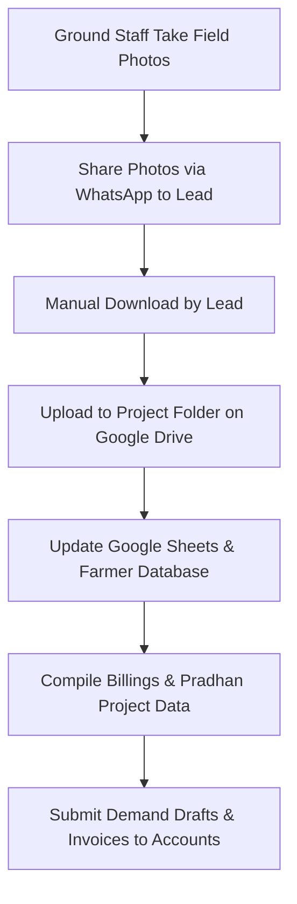
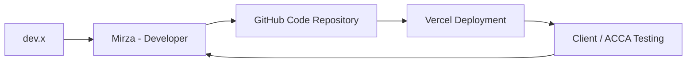

# Operational Documentation: Business Development (Company & Government Trials)

## Department Snapshot

### Time & Effort Split
* **Government Trials & Project Follow-up:** ~35% (estimated from managing trials, tracking billings, coordinating photos, and preparing demand drafts for projects like the UK Govt Project)
* **Data Compilation & Database Management:** ~25% (estimated from compiling farmer data, updating "Pradhan" datasets, and uploading field media to Google Drive)
* **Internal Coordination & Operations Handoffs:** ~20% (estimated from communicating travel plans, invoice coordination, and daily task updates)
* **Custom Tool Support & Team Training:** ~20% (estimated from coordinating application maintenance with developers and training teams on tool usecases)

### Tool Stack
* **Internal Compliance:** Zoho People
* **Project Slicing & Sourcing:** Google Drive, Google Sheets (shared with CBDO)
* **Core Communications:** Gmail, Google Calendar, WhatsApp (for travel updates, daily to-do lists, and ground-photo collection)
* **Custom Tool Development:** GitHub, Vercel (hosted custom applications maintained by developer Mirza)

### Key Frequency & Volume Metrics
* **Key Targets:** Government-sponsored trials (e.g., UK Govt Project) and Startup/B2B pilots (stated directly)
* **Data Upload Frequency:** Daily ground photos sent via WhatsApp and uploaded to Google Drive (stated directly)
* **Coordination Protocol:** Team members travel in direct alignment with regional Team Leads (stated directly)
* **Reporting Structure:** Direct reports to Co-Founder & CBDO Ankit Jain (stated directly)

### Red Flags
1. **High**: *Lack of Calendar-Leave Automation* — Leave and travel schedules do not sync automatically with Google Calendar, requiring manual entry and tracking, which introduces potential schedule coordination risks.
2. **High**: *Unstructured Task Management* — Daily operational tasks and to-dos are managed entirely through WhatsApp, relying on the Reporting Manager (CBDO Ankit Jain) to manually assign and track performance.
3. **Medium**: *Manual Operations Coordinates* — Invoice tracking and order details are handed off manually via phone calls and WhatsApp to Accounts and Logistics, rather than utilizing automated system feeds.
4. **Medium**: *Siloed Custom Application Management* — Custom tools used for trial tracking require a manual development and release loop involving an external developer (Mirza) pushing to GitHub/Vercel without an in-house product owner.
5. **Low**: *Manual Ground Media Sync* — Photos collected by field staff are sent via WhatsApp and must be manually downloaded and re-uploaded to Google Drive to log trial progress.

---

## 1. Operational Profile & Scope
* **Department/Business Unit:** Business Development (Team 2) — manages institutional B2B accounts, startup collaborations, and government agricultural trials on a Pan-India scale.
* **Core Mandate:** Facilitating government-sponsored crop trials, tracking billing compliance, gathering field usecase data, and maintaining custom trial tracking software.
* **Personnel & Alignment:**
  * **BD Executive (Shailendra Singh):** Coordinates government trials, runs field data workflows, handles invoice handoffs, and oversees tool maintenance.
  * **Co-Founder & CBDO (Ankit Jain):** Acts as the Reporting Manager, defines strategic targets, reviews shared project sheets, and manages day-to-day to-do assignments.
  * **Marketing Executive (Vandana Jain):** Design partner for project presentation decks, templates, and marketing collateral.

---

## 2. Team Structure & Task Management
* **Oversight:** Shailendra Singh manages the Government and Startup verticals, reporting directly to CBDO Ankit Jain.
* **Task Routing:** Daily priorities and checklists are distributed and tracked via WhatsApp. The CBDO is responsible for reviewing and confirming the completion of these items.
* **Field Alignment:** Team members travel in tandem with Team Leads to oversee trial sitings, meet local authorities, and guide ground-level operations.

---

## 3. Government Trials & Data Collection Workflow

### Process Sequence
1. **On-Ground Activity:** Field representatives conduct trials (e.g., UK Govt Project) and record crop progress using mobile photos.
2. **Media Collection:** Photos are sent to the BD Executive via WhatsApp.
3. **Drive Storage:** The BD Executive manually uploads the photos and documents into project-specific folders on Google Drive.
4. **Database Logging:** Farmer profiles and project parameters (including "Pradhan" project data) are compiled into shared Google Sheets.
5. **Billing and Approvals:** Billings are reconciled, Demand Drafts are prepared, and final packages are compiled for submission.
6. **Design Requests:** Design requirements for project brochures or templates are routed to Vandana Jain.

---

## 4. Systems & Custom Tool Development Loop
For custom trial tools and data capture applications, the team follows a structured developer loop:

1. **Feature Definition:** Requirements (dev.x) are shared with developer Mirza.
2. **Code Push:** Mirza writes the code and pushes it to GitHub.
3. **Deployment:** The application is deployed automatically to Vercel.
4. **Validation:** The client or internal testers (ACCA) test the live Vercel deployment. Feedback and bug reports are routed back to Mirza for resolution.
5. **Team Training:** The BD team conducts ongoing training to maintain these usecases and tools on the ground.

---

## 5. Cross-Department Dependencies

| Target Department | Nature of Dependency | Frequency / Impact |
|---|---|---|
| **CBDO (Ankit Jain)** | Operational alignment, shared sheet reviews, and WhatsApp task audits. | Daily |
| **Accounts (Shobha)** | Submitting billing details, invoice lists, and Demand Drafts (via calls/WhatsApp). | Transactional / Per billing cycle |
| **Logistics (Nihal)** | Tracking dispatch details and coordination of cargo arrivals. | Minor / Ad-hoc |
| **Marketing (Vandana)** | Designing templates, brochures, and trial reports. | Project-based |

---

## 6. Operational Friction & Bottlenecks (Audit Analysis)
*Documented under the Red Flags section at the top of this report.*

---

## 7. Audit Backlog & Follow-Up Items
* **Google Calendar Integration:** Automate the leave and travel approval tracking in Zoho People to automatically update Google Calendar, eliminating manual entry.
* **Centralize Task Tracking:** Transition daily tasks from WhatsApp threads to a dedicated CRM or project management board (e.g., Zoho Projects) for better visibility.
* **Automate On-Ground Photo Sync:** Research mobile forms (e.g., Zoho Forms or custom API) to allow field staff to upload photos directly to Google Drive, avoiding WhatsApp manual downloading.
* **Formalize Tool Maintenance SOPs:** Draft developer-to-client release guidelines for Mirza to ensure all Vercel deployments go through quality checks before client validation.
