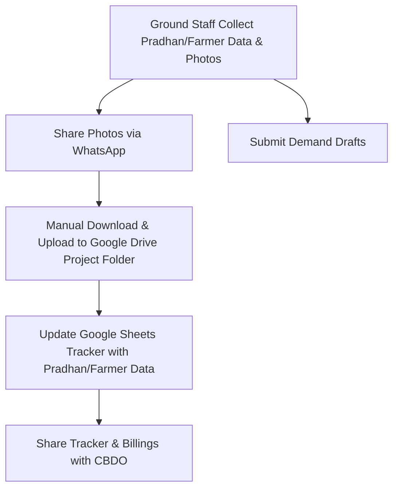

# Operational Documentation: Business Development (Government Trials & Projects)
**Interviewee:** Shailendra Singh (BD Executive — Government & Startup Verticals)
**Reporting To:** Ankit Jain (Co-Founder & CBDO)

---

## Department Snapshot

### Time & Effort Split
* **Government Trials & Project Follow-up:** ~35% (Managing government projects, collecting Pradhan/Farmer data, tracking billings, preparing demand drafts, and uploading ground photos)
* **Data Compilation & Database Management:** ~25% (Compiling farmer and Pradhan data on Google Sheets, organizing project files on Google Drive)
* **Internal Coordination & Operations Handoffs:** ~20% (WhatsApp updates for travel, task management with CBDO, invoice/PO coordination with Accounts, tracking with Logistics)
* **Design & Marketing Coordination:** ~10% (Coordinating with designer Vandana for government event banners/posters and storing on Google Drive)
* **Field Training & Team Alignment:** ~10% (Aligning field team members with trial protocols, documenting workflows, and training on updated processes)

### Tool Stack
* **Internal Compliance:** Zoho People (for travel location and attendance)
* **Project Tracking & Data Storage:** Google Drive, Google Sheets (trackers shared with CBDO)
* **Core Communications:** WhatsApp (primary for daily to-dos, PO sharing, logistics tracking, travel updates, and ground-photo collection), Gmail, Google Calendar
* **Design & Collateral:** Canva / PowerPoint (coordinated with Marketing — Vandana)

### Key Frequency & Volume Metrics
* **Key Targets:** Pan-India B2B, Startups, and Government trials (e.g., UK Govt Project).
* **Data Upload Frequency:** Daily ground photos sent via WhatsApp and manually uploaded to Google Drive.
* **Reimbursement Cycle:** Travel expenses compiled and shared with Finance/Accounts at the end of the month on a fixed date.
* **Coordination Protocol:** Team members travel in direct alignment with regional Team Leads.
* **Reporting Structure:** Direct reports to Co-Founder & CBDO Ankit Jain.

### Red Flags & Major Problems
1. **High**: *Lack of Calendar-Leave Automation* — Leave and travel schedules are not updated on Google Calendar. Effective communication of availability is missing for HR and other departments. Manual calendar updates fail because the team travels to remote areas with network issues.
2. **High**: *Unstructured Task Management* — Day-to-day operations and tasks are defined and managed entirely through WhatsApp groups by the reporting manager (CBDO). No persistent task trail exists outside chat threads.
3. **Medium**: *Manual Operations Handoffs* — New order POs, invoice details, and tracking are manually shared with Accounts and Logistics via calls and WhatsApp. Logistics tracking updates are requested manually with no central dashboard.
4. **Medium**: *Manual Ground Media Sync* — Photos collected by field staff are sent via WhatsApp and must be manually downloaded/uploaded to project folders on Google Drive. Individual-level photos are stored per Pradhan and per executive team member as separate records on Drive (not just project-level photos).
5. **Medium**: *No Centralized Farmer/Pradhan Database* — All Farmer and Pradhan records are maintained in manual Google Sheets. Data is not searchable, not secure, and not structured for future analysis or reference.
6. **Low**: *Documentation Gap — Demand Draft Submission* — The team confirmed Demand Drafts are submitted via three distinct methods, but only one method was described during the audit. The remaining two must be documented in a follow-up session.

---

## 1. Operational Profile & Scope
* **Department/Business Unit:** Business Development (Government & Startup Vertical) — manages institutional B2B accounts, startup collaborations, and government agricultural trials on a Pan-India scale.
* **Core Mandate:** Facilitating government-sponsored crop trials, tracking billing compliance, gathering field data from Pradhans and Farmers, processing orders, and coordinating with Accounts and Logistics.
* **Personnel & Alignment:**
  * **BD Executive (Shailendra Singh & Team):** Coordinates government trials, runs field data workflows, handles PO/invoice handoffs, submits demand drafts, and liaises across departments.
  * **Co-Founder & CBDO (Ankit Jain):** Acts as the Reporting Manager, manages day-to-day to-do assignments via WhatsApp, reviews shared Google Sheets trackers.
  * **Marketing Executive (Vandana Jain):** Design partner for project presentation decks, event banners, and marketing collateral.

---

## 2. Team Structure & Task Management
* **Oversight:** Shailendra Singh manages the Government and Startup verticals, reporting directly to CBDO Ankit Jain.
* **Task Routing:** Major day-to-day operations and to-dos are defined and assigned by the CBDO on WhatsApp groups. No formal task management tool is in use.
* **Field Alignment:** Team members travel in tandem with Team Leads. Attendance and travel locations are marked on Zoho People.
* **Reimbursements:** Travel plans and expenses are updated over WhatsApp to the CBDO and Accounts team, compiled, and submitted for reimbursement at the end of the month on a fixed date.

---

## 3. Government Trials & Data Collection Workflow

### Process Sequence
1. **On-Ground Activity:** Field representatives conduct trials, gather data from Pradhans and Farmers, capture field photos, and submit Demand Drafts.
2. **Media Collection:** Photos are sent to the BD Executive via WhatsApp. The BD Executive manually downloads and uploads them into specific project folders on Google Drive. Individual-level photos are stored **per Pradhan** and **per executive team member** as separate records — not just aggregated project-level photos.
3. **Database Logging:** Farmer profiles, Pradhan data, billings, and billing photos are compiled into shared Google Sheets and stored on Drive.
4. **Design Requests:** Design requirements for government event banners or collaterals are routed to Vandana. Final designs are stored and retrieved from Google Drive.

> ⚠️ **Documentation Gap — Demand Draft Submission Methods:** The team stated that demand drafts are submitted via **three distinct methods**, but only one method (on-ground photo capture → WhatsApp → manual Drive upload) was described during the audit session. The remaining two submission methods were not elaborated upon and must be captured in a follow-up session.

---

## 4. Order Processing & Logistics Workflow
1. **Order Initiation:** For new orders, BD shares the Purchase Order (PO), invoice details, and tracking details to the Accounts and Logistics teams via WhatsApp.
2. **Dispatch:** Once payment is cleared by the Accounts team, items are dispatched from Logistics.
3. **Tracking Updates:** BD manually requests tracking updates from Logistics via calls and WhatsApp, as there is no specific dashboard available to the team.

---

## 5. Cross-Department Dependencies

| Target Department | Nature of Dependency | Frequency / Impact |
|---|---|---|
| **CBDO (Ankit Jain)** | Task assignments via WhatsApp, reviewing project sheets and trackers. | Daily |
| **Accounts / Finance** | Monthly travel reimbursement submissions, new order POs, and invoice details. | High / Regular |
| **Logistics** | Dispatching items after payment clearance, manually providing tracking updates via calls/WhatsApp. | High / Regular |
| **HR** | Attendance marking on Zoho People; currently lacking visibility on calendar availability/leaves. | Daily |
| **Marketing (Vandana)** | Designing banners and marketing collaterals for government events. | Project-based |

---

## 6. Proposed Solutions & Automation Workflows (Audit Findings)

Based on the audit, the following solutions should be built to resolve current bottlenecks:

* **Attendance & Travel Calendar Integration:** Integrate Google Calendars into mobile phones so travel plans and leaves update automatically. This will bypass network constraints in remote areas and display real-time availability on a dashboard for HR to manage workloads effectively.
* **Centralized Reimbursement Flow:** Implement a single platform for travel reimbursements across departments (specifically BD). By uploading all invoices to one platform, amounts can be automatically fetched and easily reconciled by the Accounts team.
* **Digital Asset Management (DAM) via RAG Bot:** Connect Google Drive marketing collaterals (banners, posters) to a RAG bot on a common company dashboard. This allows team members to quickly search and retrieve specific marketing assets by simply typing their requests.
* **Common CRM for BD Team:** Build a common CRM to replace manual Google Sheets, allowing the BD team to securely save and maintain detailed records of all Farmer and Pradhan data for future use.
* **Unified Accounts & Logistics Dashboard:** Create a single shared form/dashboard for BD, Accounts, and Logistics to gather all data required for invoicing and logistics tracking.
* **WhatsApp Bot for Tracking:** Connect the unified dashboard to a WhatsApp bot capable of instantly answering queries from team members regarding specific package statuses or invoice details, eliminating manual follow-ups.
