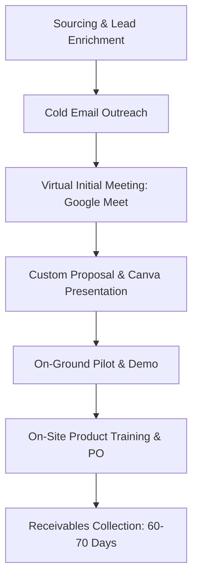

# Operational Documentation: Business Development (NGO / CSR)

## Department Snapshot

### Time & Effort Split
* **Lead Sourcing & Outbound Outreach:** ~45% (estimated)
* **Custom Proposal & Deck Preparation:** ~20% (estimated)
* **On-Ground Operations (Demos/Training):** ~20% department-wide; ~90% of field team effort (estimated)
* **Payment Recovery & Collections Chasing:** ~10% department-wide; ~15%–20% of AM-BD Lead's effort (estimated)
* **Pipeline Monitoring & Reporting:** ~5% (estimated)

### Tool Stack
* **Tracking & Pipelines:** Google Sheets (4-sheet manual structure)
* **Sourcing & Enrichment:** LinkedIn (organic feed scrolling), Contactout (browser email miner), Apollo AI (contact lookup)
* **Proposal & Collateral:** Canva, PowerPoint
* **Comms & Meetings:** Email (Gmail), WhatsApp (client updates), Google Meet (initial video calls)

### Key Frequency & Volume Metrics
* **Vertical Sales Target:** **100 MT** (stated directly)
* **Active Lead Volume:** **40–50** leads being tracked (stated directly)
* **Payment Collection Cycle:** **60–70 days** (stated directly)
* **Manual Follow-Up Frequency:** Every **4–5 days** (stated directly)
* **Sourcing Network Size:** **~9,500** LinkedIn connections (stated directly)

### Red Flags
1. **High**: *Extended Receivables Cycle* — The vertical suffers from a **60–70 day** collection cycle, requiring manual chasing by leadership and locking up cash flow.
2. **Medium**: *Ad-Hoc Follow-Up Cadence* — BD Executives rely on memory to follow up every **4–5 days** from spreadsheets, introducing a high risk of lead neglect.
3. **Medium**: *Sourcing Scaling Constraint* — Sourcing depends on scrolling a personal LinkedIn feed rather than structured market search, limiting pipeline scalability.
4. **Low**: *Manual Broadcomms* — Sharing agronomy reports/newsletters is done one-by-one to **20–30** contacts on WhatsApp, causing a communication bottleneck.

---

## 1. Operational Profile & Scope
* **Department/Business Unit:** Business Development (NGO/CSR) — a specialized vertical focused on securing high-volume contracts with non-governmental organizations (NGOs) and Corporate Social Responsibility (CSR) departments.
* **Core Product Focus:** Bulk supply of soil moisture retention polymers for on-ground agricultural and water-conservation initiatives.
* **Vertical Sales Target:** **100 Metric Tons (MT)** (stated directly as a target carried over from a previous cycle).
* **Target Clients:** NGOs and CSR wings of corporations managing agriculture, watershed, and rural development programs.

---

## 2. Team Structure & Effort Distribution

### Personnel & Role Demarcation
The department has a total headcount capacity of **5 roles** (stated directly: 4 active, 1 vacant at the time of audit):
* **Vikash Mehta (AM-BD, NGO/CSR Lead):** Manages key accounts, leads payment recovery/collections, and oversees the vertical pipeline.
* **Gaurav Dwivedi (BD Executive):** Handles sourcing, contact discovery, initial outreach, and initial meetings.
* **BD Executive (Vacant):** Position planned for additional sourcing and lead generation capacity.
* **Field Execution Team (2 Personnel):** Execute on-ground product demonstrations, conduct training sessions, and monitor post-trial impact.

---

## 3. Lead Generation & Sourcing Workflow

### Primary Sourcing Channel
* **LinkedIn Network Scraping:** Sourcing is heavily reliant on LinkedIn. Outbound leads are discovered primarily by scrolling the home feed rather than active keyword searches. This is enabled by a pre-existing network of ~**9,500** relevant industry connections in agriculture and social sectors (stated directly).
* **Inbound LinkedIn Leads:** Organizational content posted on LinkedIn generates inbound inquiries from CSR and NGO decision-makers, who are then transitioned to formal email outreach.
* **Secondary Channels:** Referral networks, industry conferences, online agricultural training sessions, and general landing page forms.

### Outbound Lead Sourcing & Enrichment
1. **Identification:** Target NGOs working in agricultural or water projects are identified.
2. **Filtering:** Leads are reviewed to verify project alignment (specifically water-scarce or agricultural focus).
3. **Contact Mining:** Decision-maker contact details (e.g., Sales Head, CSR Head, Procurement) are extracted using Contactout (browser extension) and Apollo AI (stated directly).

---

## 4. Sales Pipeline & Deployment Lifecycle

### Process Sequence
1. **Initial Outreach:** Cold emails are sent to target contacts. Saturdays are avoided due to low response rates, and Mondays are prioritized for initial contact (stated directly).
2. **First Contact Meeting:** Once interest is confirmed, a virtual Google Meet is scheduled. Phone calls are avoided before an initial video meeting is held.
3. **Proposal & Deck Customization:** Customized Canva or PowerPoint presentation slides outlining partnership details are prepared for each NGO.
4. **On-Ground Demonstration:** Field personnel travel to the project site to set up on-ground trials.
5. **Product Training:** Field team conducts technical training on application dosage and tracking.
6. **Order Confirmation & PO:** Order is closed and PO is generated once trials prove successful.

---

## 5. Tooling & Pipeline Architecture
* **Lead Sheet Architecture:** Sales pipeline is managed manually via a Google Sheet containing four sequential tabs:
  * **Tab 1 (Leads Generated):** Master list of discovered targets.
  * **Tab 2 (Emailed Leads):** Log of initial outreach attempts.
  * **Tab 3 (Responded Leads):** List of prospective leads with confirmed interest.
  * **Tab 4 (Meetings & Sites):** Status log of virtual meetings and active trial sites.
  * **Auxiliary Sheets:** Purchase history records (for account re-engagement) and dispatch/logistics tracking.
* *Refer to the Tool Stack in the snapshot at the top of this report for system listings.*

---

## 6. Cross-Department Dependencies & Reporting

| Target Department | Nature of Dependency | Frequency / Impact |
|---|---|---|
| **Finance/Accounts** | Payment reconciliation and credit monitoring. | Daily interaction during collection periods |
| **Logistics** | Processing and tracking bulk dispatches for NGO pilots. | Transactional (per trial setup) |
| **BD Reporting** | Performance reports consolidated under vertical leadership. | Monthly review against 100 MT target |

---

## 7. Operational Friction & Bottlenecks (Audit Analysis)
*Documented under the Red Flags section at the top of this report.*

---

## 8. Audit Backlog & Follow-Up Items
* **On-Ground Operations Metrics:** Verify the exact capacity, travel budgets, and demo-to-order conversion timelines of the two on-ground execution personnel.
* **Collections Gaps with Accounts:** Cross-reference the 60–70 day NGO payment delay with Shobha's (Accounts) team records to identify reconciliation gaps or potential invoicing improvements.
* **Lead Generation Baseline Data:** Gather historical data on the number of leads moving monthly from Tab 1 (Sourced) to Tab 4 (Meeting/Pilot) to establish a baseline conversion rate.
* **New Hire Onboarding:** Monitor the impact on lead volume once the vacant BD Executive position is filled.
