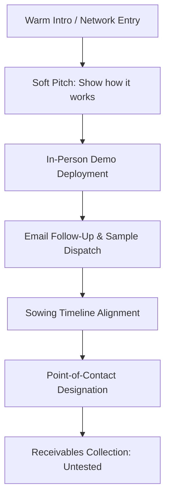

# Operational Documentation: Business Development (Seed)

## Department Snapshot

### Time & Effort Split
* **Field Travel & In-Person Demos:** **60%–70%** (stated directly: **15–20 days/month** physical travel)
* **Proposal & Pitch Creation:** ~15% (estimated)
* **Sourcing & Context Research:** ~10% (estimated)
* **Follow-up Administration:** ~5% (estimated)

### Tool Stack
* **Tracking & Pipelines:** Excel (ad-hoc local spreadsheets)
* **Research & Sourcing:** ChatGPT, Google News search
* **Reference Data:** Google Drive (shared R&D trial database)
* **Comms & Outreach:** Email, phone calls, physical visits

### Key Frequency & Volume Metrics
* **Annual Sales Target:** **90 MT** (stated directly)
* **Active Leads/Follow-ups:** **25–30** at any time (stated directly)
* **Stage Conversion Rate:** **15%–20%** (~4–5 out of 25–30 progress; stated directly)
* **Field Travel Allocation:** **15–20 days/month** (stated directly)
* **Off-Season Contact Cadence:** Once every **2–3 months** (stated directly)
* **Proposal Creation Turnaround:** **1–2.5 days** (stated directly)
* **Manager Role Tenure:** **~6 months** (stated directly)

### Red Flags
1. **High**: *Complete Lack of Follow-Up Cadence* — The BD Manager operates without a CRM or structured follow-up guidelines, relying on memory and ad-hoc spreadsheets, which limits pipeline tracking.
2. **Medium**: *Dual Executive Reporting* — The Seed vertical has dual reporting lines splitting between the COO (Puran Singh Rajput) and CBDO (Ankit Jain), presenting task prioritisation and alignment risks.
3. **Medium**: *Siloed Sourcing Inputs* — Lead identification is based on speculative manual scanning of Google News and ChatGPT, with no intent data or structured target signal feeds.
4. **Low**: *Single-Point Solo Operation* — With previous internships concluded, the entire Pan-India vertical is run by a single BD Manager, exposing sales execution to capacity bottlenecks.

---

## 1. Operational Profile & Scope
* **Department/Business Unit:** Business Development (Seed) — an institutional vertical focused on B2B sales of polymer-based seed coatings and soil additives directly to seed companies, agricultural institutions, and universities.
* **Geographical Scope:** Pan-India, with active field operations concentrated in South India (Karnataka, Andhra Pradesh, and Telangana).
* **Annual Sales Target:** **90 Metric Tons (MT)** (stated directly).
* **Sales Model:** Demo-led institutional sales leveraging trial data, university certifications, and on-ground crop yield proof points.

---

## 2. Team Structure & Effort Distribution

### Personnel & Reporting
* **Management (BD Manager - Sameer Vishnuji Mahiskar):** Oversees the Seed business line, manages institutional accounts, conducts field travel, and prepares client proposals. Reports under a dual reporting structure to both Puran Singh Rajput (COO) and Ankit Jain (CBDO) (stated directly).
* **Field Execution / Interns (Historical):** Previously supported by **2 interns** focused on South India for on-site visits, data collection, and checking demo utilization. The internships have ended, and a new full-time executive is in the recruitment pipeline.

---

## 3. Lead Generation & Research Workflow

### Sourcing & Intent Research
* **Target Identification:** BD utilizes personal contacts and networks from prior employment to secure warm introductions.
* **Contextual Sourcing:** BD uses ChatGPT to compile background summaries on prospective seed companies, supplemented by manual Google News searches.
* **Data Limitations:** The sourcing workflow lacks structured intent data to identify specific company needs or distress signals.

### Reference Data Sharing (R&D Interface)
* BD accesses a shared Google Drive maintained by the R&D department containing trial certificates and past research results. This public-facing data is used directly as case-study material during pitches to validate yield and performance claims.

---

## 4. Sales Pipeline & Demo Lifecycle

### Process Sequence
1. **Initial Access:** BD leverages personal networks to establish contact with founders or senior sales representatives.
2. **Initial Meeting Pitch:** The conversation is framed as an educational demonstration ("how it works") rather than an active sales pitch to secure meeting approvals.
3. **On-Site Trial Deployment:** BD executes on-ground trials with the target seed company or university.
4. **Post-Demo Follow-Up:** Follow-ups are conducted via email/phone to coordinate sample dispatches and verify sowing dates.
5. **Account Management:** BD identifies point-of-contact handling roles on both sides (the client's trial manager and the internal account owner) to coordinate tracking.
6. **Receivables Recovery:** BD is responsible for post-sale payment collection; however, this workflow has not been operationally tested as no sales have closed within the initial 6 months of this vertical's operation (stated directly).

---

## 5. Proposal Development Workflow
* **Generic Content:** Pre-configured product specification slides are reused across institutional pitches.
* **Custom Content:** Crop-specific and company-specific slides must be custom-developed for each prospect. This custom analysis is the primary driver of proposal creation time, requiring **1 day** under focused conditions and up to **2.5 days** when split with other tasks (stated directly).

---

## 6. Tooling & Pipeline Architecture
* **System Summary:** Tracking is managed via local spreadsheets, and research is supplemented with ChatGPT and Google News scans.
* *Refer to the Tool Stack in the snapshot at the top of this report for system listings.*

---

## 7. Cross-Department Dependencies

| Department | Nature of Dependency | Frequency / Impact |
|---|---|---|
| **R&D** | Providing lab trial certificates and verifying crop-specific application results. | Continuous access / Critical for pitches |
| **Finance / COO** | Operational reporting and credit line approvals for future deals. | Dual reporting (Puran Singh Rajput / Ankit Jain) |
| **Logistics** | Shipping product samples to trial sites and coordinating sowing window dispatches. | Transactional (per demo setup) |

---

## 8. Operational Friction & Bottlenecks (Audit Analysis)
*Documented under the Red Flags section at the top of this report.*

---

## 9. Audit Backlog & Follow-Up Items
* **Collections Workflow Implementation:** Monitor and document the collections process once the first paying accounts are closed.
* **Executive Hiring:** Track integration and onboarding of the incoming full-time BD Executive.
* **Operational Alignment:** Clarify reporting flows between COO and CBDO roles to resolve any task-prioritization conflicts.
* **Quantitative Funnel Baseline:** Audit spreadsheet logs to determine historical conversion rates from "Demo Deployed" to "Sample Dispatched".
