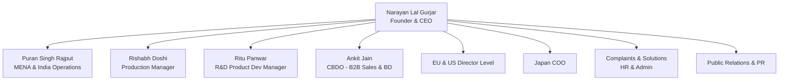

# Operational Documentation: CEO Office (Narayan Lal Gurjar)

## Department Snapshot

### Time & Effort Split
* **Strategic Planning & Policy Formulation:** ~30% (estimated from coordinating with Head of Departments, drafting policies, and addressing company bottlenecks)
* **Financial Oversight & Performance Reviews:** ~25% (estimated from tracking region-wise revenue, key client P&Ls, and expense budgets)
* **Internal Coordination & Issue Resolution:** ~20% (estimated from coordinating complaints/solutions for HR & Admin, PR, and internal operations)
* **International Expansion & Subsidiary Reporting:** ~15% (estimated from managing EU & US Director-level relationships and reviewing Japan COO reports)
* **High-Level Talent Approvals:** ~10% (estimated from review and approval of all Manager & above recruitment)

### Tool Stack
* **Operational Comms & Collaboration:** Slack (with integrated Slack apps for user flows/approvals), WhatsApp, Email (Gmail)
* **Reporting & Tracking:** Shared Google Sheets (ad-hoc department updates, revenue sheets, expense trackers)

### Key Frequency & Volume Metrics
* **Forecast Runway Visibility:** **3–4 months** projection window before planning risks arise (stated directly)
* **Hiring Approval Threshold:** **Manager & above** hires require final CEO approval (stated directly)
* **Primary Reporting Segments:** **4** domestic operational leaders + **2** international reporting channels (stated directly)
* **Corporate Communication Channels:** Slack prioritized for internal team alignment; WhatsApp/Email for external and rapid follow-ups

### Red Flags
1. **High**: *Short-Term Forecast Visibility* — Projections and demand forecasting are constrained to a **3–4 month** runway. This short visibility creates operational and inventory planning risks for manufacturing and sales execution.
2. **High**: *Data Management & Real-time Visibility Gap* — The lack of real-time data integration forces manual checks across divisions. The CEO lacks a single consolidated dashboard for region-wise revenue, client P&L, and expense compliance.
3. **Medium**: *Fragmented Travel & Expense Approvals* — Travel and expense approvals are handled manually across unstructured email threads and Slack. This method lacks database visibility and creates approval bottlenecks.
4. **Medium**: *Siloed Ground-Level Farmer Feedback* — Agricultural usecase and feedback data from ground-level farming operations are not systematically aggregated, hindering R&D and strategic marketing improvements.
5. **Low**: *Unstandardized Workflow Software* — The Japan subsidiary successfully utilizes free approval and workflow apps within Slack, but this process automation has not been deployed across India or MENA operations.

---

## 1. Operational Profile & Scope
* **Executive Role:** Founder & Chief Executive Officer (CEO) — Narayan Lal Gurjar.
* **Scope of Responsibility:** Strategic corporate vision, policy creation, high-level corporate alignment, international subsidiary compliance (US, EU, Japan), public relations, and final governance approvals.
* **Direct Execution Bounds:** The CEO maintains oversight over all core operations, delegating daily executions to department heads while holding final approval rights over strategic policies, financial budgets, and manager-level hires.

---

## 2. Team Structure & Reporting Lines

### Reporting Segments
1. **MENA & India Operations (Puran Sir):** Joint oversight on regional logistics, commercial execution, and operational strategy.
2. **Production & Quality Control (Rishabh Doshi):** Direct alignment on Udaipur/Coimbatore plant yields, machinery CAPEX, and raw material procurement.
3. **Research & Development (Ritu Panwar):** Product formulation updates, agricultural testing trials, and crop target validations.
4. **B2B Sales & Business Development (Ankit Jain):** Oversight on institutional sales, distributor agreements, and corporate seed/cocopeat accounts.
5. **International Subsidiaries:** Direct reporting lines from the Japan COO and Director-level heads in the EU and US.

---

## 3. Financial Monitoring & Key Metrics
The CEO monitors three critical areas of corporate financial performance:
* **Revenue (Region-wise):** Reviewing growth metrics across Indian territories, MENA B2B accounts, and international channels.
* **P&L (Key Clients):** Tracking margin contributions and accounts receivable risk for major agricultural buyers.
* **Expenses (Policy Compliance):** Ensuring departmental expenses align with corporate budgets and policy guidelines.

---

## 4. International Operations Coordination
* **Subsidiary Governance:** The CEO reviews operational reports from the Japan COO and coordinates expansion strategies with EU and US regional Directors.
* **Software Adoption Disparity:** The Japan subsidiary has successfully automated its user flows and approval workflows using free Slack applications. These integrated apps have not been adopted by the domestic Indian or MENA teams, leaving those regions reliant on manual email approvals.

---

## 5. Approval & Policy Making Protocols
* **Policy Design:** Corporate policies (HR, travel, expenses, and compliance) are co-created with Department Heads but require final CEO sign-off.
* **Talent Acquisitions:** Standard hiring is delegated to HR (Dolly Mehta's team) and reporting managers. However, recruitment for all positions at the **Manager and above** level requires explicit CEO review and approval.
* **Administrative Resolutions:** The CEO plays an active role in resolving organizational complaints and setting administrative solutions across HR and general operations.

---

## 6. Cross-Department Dependencies

| Target Department | Nature of Dependency | Frequency / Impact |
|---|---|---|
| **MENA & India Operations** | Region-level performance updates and operational triage. | Daily / Critical |
| **All Department Heads** | Submitting expense budgets, policy compliance reviews, and strategic hiring requests. | Weekly / Policy cycles |
| **Production & R&D** | Batch quality standards, product formulation revisions, and crop testing reports. | Transactional / Project-based |
| **B2B Sales & CBDO** | High-value commercial contract approvals, pricing policy overrides, and key account updates. | Daily |
| **HR & Administration** | Escalated employee complaints, organizational structure updates, and Manager+ hiring approvals. | Ad-hoc / Recruitment cycles |

---

## 7. Operational Friction & Bottlenecks (Audit Analysis)
*Documented under the Red Flags section at the top of this report.*

---

## 8. Audit Backlog & Follow-Up Items
* **Forecast Integration Review:** Connect the Sales and Production forecasting models to extend projection visibility beyond the current 3–4 month window.
* **Standardize Approval Workflows:** Implement automated approval workflows (similar to the Slack-based apps utilized in Japan) for travel, expenses, and policy waivers across India and MENA teams.
* **Real-time Reporting Dashboard:** Evaluate options for a consolidated Zoho dashboard or BI layer to provide the CEO with instant visibility into region-wise revenue and client P&L metrics.
* **Establish Usecase Data Loops:** Create a systematic process to compile ground-level farmer feedback and route it directly to R&D and Marketing teams.
