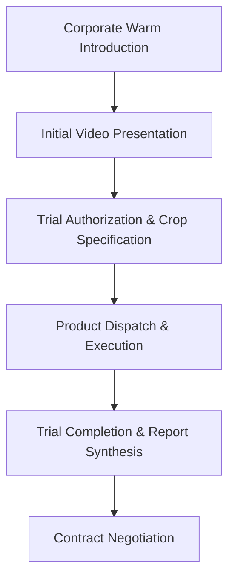

# Operational Documentation: Operations & Finance (COO Office)

## Department Snapshot

### Time & Effort Split
* **Communication & Operational Triage:** ~45% (estimated from **50–80 emails/day** and **150+ WhatsApp groups**)
* **Retail Sales & Ground Compliance Oversight:** ~20% (estimated)
* **Board, Investor & BOD Reporting Prep:** ~15% (estimated)
* **Approvals & Administrative Processing:** ~10% (estimated)
* **Marketing Projections & Budgeting:** ~10% (estimated)

### Tool Stack
* **Tracking & Pipelines:** Mobile field force tracking app (with geolocation), Google Sheets
* **Comms & Video Meetings:** Email, WhatsApp, Slack, Google Meet, Zoom, MS Teams
* **Finance & Reporting:** Zoho Suite (Books, Expense, Payroll, People)

### Key Frequency & Volume Metrics
* **Daily Email Load (Working Days):** **50–80 emails/day** (stated directly)
* **Daily Email Load (Saturdays):** **10–12 emails/day** (stated directly)
* **Shared WhatsApp Groups (Single Colleague):** **151 shared groups** (stated directly)
* **Marketing Budget Ceiling:** **25%, 30%, or 50% of projected revenue** (stated directly)
* **Investor Relations Involvement:** **~1%** of overall corporate load relative to CBDO (stated directly)
* **Decision Capture Gaps:** Post-**10:00 PM** ideas (stated directly)

### Red Flags
1. **High**: *Executive Communication Saturation* — Managing **50–80 emails/day** using "unread" filters, combined with **151 shared WhatsApp groups** with a single staff member, creates a high bottleneck risk for executive approvals.
2. **Medium**: *Field Tracking & Compliance Leakage* — Field force app failure in low-network regions, coupled with distributor pipeline status omissions, leaves the retail channel without data integrity.
3. **Medium**: *Marketing Accountability Gap* — Operating without a dedicated marketing owner or ROI analytics leads to execution delays and unmeasured advertising expenses.
4. **Low**: *Lost Decision Opportunities* — The absence of a capture channel for late-night decisions (post-10:00 PM) results in lost operational ideas.

---

## 1. Operational Profile & Scope
* **Executive Role:** Chief Operating Officer (COO) — Puran Singh Rajput.
* **Scope of Responsibility:** Strategic oversight of business operations, retail sales compliance, international business development (MENA), marketing projections, and board/investor reporting preparation.
* **Direct Execution Bounds:** The COO oversees Finance, HR, and Marketing, but direct day-to-day execution is delegated. 
* **Key Functional Targets:** Establishing structured operational reporting, optimizing field force compliance, and managing executive communication overhead.

---

## 2. Team Structure & Effort Distribution

### Vertical Alignment & Headcount
The COO Office provides oversight across several distinct teams:
* **Marketing:** No dedicated manager is active. Projections and budget approvals are managed by the COO, while execution is handled as an auxiliary task by Gaurav (BD Executive) alongside his primary duties.
* **Retail Sales Field Team:** Composed of regional managers and field representatives executing crop-level sales.
* **MENA Business Development:** Composed of Neha Pathak (MENA Lead) and **1 vacant/attrition-gated BD position** under recruitment.
* **Operations Support:** Administrative and financial data compilation is supported by the Finance and Accounts teams.

---

## 3. Marketing Operations
* **Budget Allocations:** Projections and campaign budgets are defined by the COO. Total marketing spend is evaluated against informal sanity check thresholds of **25%, 30%, or 50% of projected revenue** (stated directly).
* **Campaign Channels:** Includes offline (agricultural exhibitions, print) and online channels (social media platforms, email marketing, and newsletters).
* **Operations Lag:** The lack of a dedicated marketing manager results in execution delays (referred to as significant lag) between budget approval and campaign launch.
* **ROI Measurement:** There is no tracking of return on investment (ROI) or conversion metrics for social media and advertising campaigns due to the lack of an accountable owner.

---

## 4. Retail Sales Operations & Field Compliance
* **Ground Tracking Tooling:** Field sales representatives are tracked using a mobile application featuring map and geolocation integration. The tool suffers from poor performance under low network conditions, causing ground-level compliance gaps.
* **Onboarding & Pipeline Status:** There is no centralized system of record for distributor onboarding. The documentation status and approval stage of individual distributors in the sales pipeline remain undocumented.
* **Field Data Collection:** Field data is gathered using ad-hoc text templates sent via WhatsApp. Formatting and compliance are inconsistent and vary based on individual entry preferences.
* **Feedback Loops:** Ground-level qualitative data (e.g., product complaints or farmer feedback) is not systematically logged, resulting in a lack of structured feedback to product development and leadership.

---

## 5. MENA / Business Development Operations

### Pipeline Lifecycle
The international B2B sales cycle for large agricultural corporations (e.g., Nadec) follows a standard sequence:

* **CRMs Requirements:** The department requires a HubSpot-style CRM to track corporate deals. The system must support a parent "Company" record with nested "Deal/Crop Accounts," allowing parallel tracking of independent crop trials, message histories, and touchpoint frequencies.

---

## 6. Investor, Board & CXO Reporting Protocols
* **Investor Relations:** Direct investor relations and fundraising are primarily led by Ankit Jain (CBDO). The COO’s direct involvement is limited to approximately **1%** of this workload (stated directly), primarily focused on operational data inputs.
* **Board Prep Workflow:**
  1. The COO designs the structure for new reporting requirements during their initial run.
  2. Recurring reports are delegated to the operational team.
  3. The team coordinates data collection timelines and consolidates department inputs.
  4. Structured inputs are delivered to the Finance team to compile final P&L statements.
* **Delegation Principle:** Operational personnel are insulated from administrative reporting tasks to maintain focus on direct sales. The COO drafts investor-ready decks from verbal updates provided by the team rather than delegating draft creation.

---

## 7. Communication & Approval Protocols
* **Email Communication Volume:**
  * **Working Days:** **50–80 emails/day** (stated directly).
  * **Off-Days (e.g., Saturdays):** **10–12 emails/day** (stated directly).
  * **Triage Method:** Emails are managed strictly via "unread" markers. Read items are deprioritized, exposing the workflow to missed follow-ups.
* **WhatsApp Saturation:** WhatsApp is the default communication channel, resulting in group saturation. For example, a profile check revealed **151 shared groups** (stated directly) between the COO and a single team member.
* **Decision Gaps:** Standard operational decisions are routed via email or WhatsApp. Decisions conceived outside of standard hours (e.g., after **10:00 PM**) lack a capture mechanism and are prone to being forgotten.

---

## 8. Operational Friction & Bottlenecks (Audit Analysis)
*Documented under the Red Flags section at the top of this report.*

---

## 9. Audit Backlog & Follow-Up Items
* **Marketing Ground Operations:** Interview Gaurav (BD Executive) to evaluate the actual time spent on marketing execution and identify resource gaps.
* **Field Compliance Audits:** Gather feedback from the retail sales field team to determine if application issues are caused by technical bugs or user non-compliance.
* **International Pipeline Analysis:** Validate Neha Pathak's sales pipeline against the trial lifecycle to confirm historical conversion rates.
* **Investor Relations Workload:** Interview Ankit Jain (CBDO) to document the end-to-end investor relations workflow and check for resource dependencies.