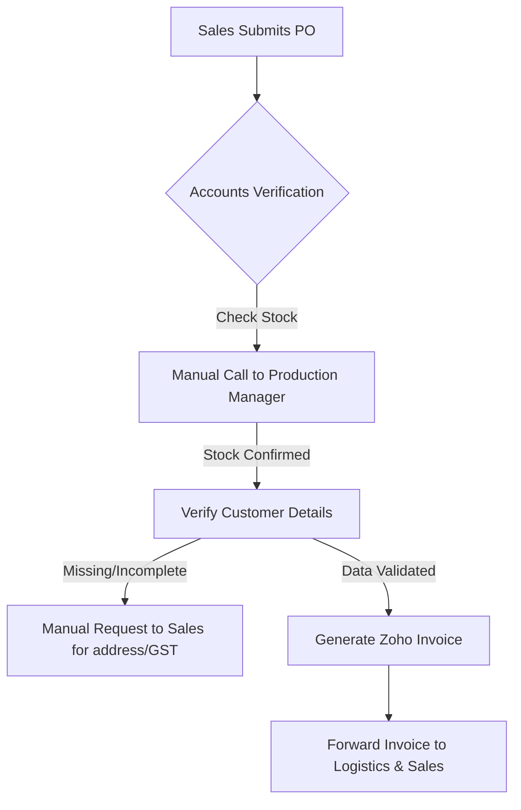

# Operational Documentation: Finance & Accounts

## Department Snapshot

### Time & Effort Split
* **GST/TDS Regulatory Reconciliation:** ~35% (estimated from **1–2 weeks** dedicated time per cycle)
* **Bank Reconciliation & Inbound Matching:** ~25% (estimated)
* **Invoicing, PO Checks & Master Data Validation:** ~20% (estimated)
* **COGS Valuation & Manual Reporting:** ~15% (estimated)
* **Travel Expense Auditing & Processing:** ~5% (estimated)

### Tool Stack
* **Accounting & General Ledger:** Zoho Books (with auto bank feeds)
* **Inventory Management:** Zoho Inventory (integrated with Books)
* **Expense Management:** Zoho Expense (reimbursements)
* **Payroll & HR Records:** Zoho Payroll, Zoho People

### Key Frequency & Volume Metrics
* **GST Reconciliation SLA:** **1–2 weeks** per tax cycle (stated directly)
* **COGS Margin Variance:** **50% to 70%–77%** month-to-month fluctuation (stated directly)
* **Accounts Team Scale:** **3** full-time personnel (stated directly)
* **Invoicing Address Cleanliness:** ~**90%** standard fields complete first time (stated directly)

### Red Flags
1. **High**: *Untraceable COGS Margin Volatility* — Lack of Work-in-Progress (WIP) valuation and grade-based costing in Zoho Inventory forces manual averaging, leading to monthly margin swings of **50%–77%**.
2. **High**: *Manual Tax Compliance Load* — Manual reconciliation of GSTR reports against internal Books ledgers consumes **1–2 weeks** of resource time monthly.
3. **Medium**: *Lack of Real-time Stock Visibility* — Accounts cannot check stock levels before invoicing, requiring manual phone calls to the Production Manager for every billing request.
4. **Medium**: *Manual Sales Quantity Compilation* — Zoho Books reports sales only by value, requiring Accounts to manually extract, compile, and normalize variant size reports to obtain tonnage figures.

---

## 1. Operational Profile & Scope
* **Department/Business Unit:** Finance & Accounts — manages corporate bookkeeping, regulatory tax filing, cost accounting, inventory valuation, and employee expense auditing.
* **Team Structure & Roles:**
  * **Finance Head (Shobha Shekhawat):** Directs financial strategy, budgeting, tax compliance, and system-level process design.
  * **Senior Accounts Manager (Rajat Dhaker):** Manages bank reconciliation, GST filing inputs, and client invoicing.
  * **Junior Accounts Manager (Gaurav Menaria):** Processes account entries, reviews expense receipts, and tracks vendor payments.

---

## 2. Tool Stack & System Integrations Context
* **System Integration Limits:** Full-time employees utilize individual logins. Contractors, temporary field workers, and interns do not have system access. Their expense claims are submitted verbally or via WhatsApp and entered manually by reporting managers.
* **Reconciliation Silos:** Systems share data tables but lack automated cross-platform data reconciliation in inventory, logistics, and vendor master records.
* *Refer to the Tool Stack in the snapshot at the top of this report for system listings.*

---

## 3. Inventory Valuation & COGS Costing Workflow

### Cost of Goods Sold (COGS) Volatility
The system logs inconsistent monthly COGS fluctuations, with costs shifting between **50% and 70%–77%** of revenue (stated directly) without clear operational explanation or automated traceability.

### Work-in-Progress (WIP) Valuation Gap
* **Raw Material Intake:** The system tracks incoming raw material volumes and direct consumption for single-step manufacturing.
* **WIP Visibility:** There is no accounting method to value partially processed materials (Work-in-Progress) during active production runs.
* **Multi-Variant Costing:** Products are processed into multiple grades (e.g., Grades A, B, and C) and packaged into different SKU sizes (e.g., 1kg vs. 5kg). Zoho Inventory does not natively compute grade-based WIP costing or separate unit valuations, requiring manual spreadsheet averaging.
* **Packaging Materials Allocation:** Packaging materials are purchased in bulk and expensed as a lump sum. They are not tracked or amortized against actual usage on the production line, distorting monthly COGS.
* **Depreciation & Overhead Splits:**
  * Factory asset depreciation and maintenance costs are not factored into the product cost basis due to the lack of an active asset register.
  * Utility and facility costs are not split between factory operations (direct costs) and administrative offices (overhead costs).

---

## 4. Order Billing & Dispatch Workflow

* **Stock Verification Gap:** The Accounts team lacks real-time inventory visibility. Every invoice request requires a manual phone call to the Production Manager to confirm physical stock availability and dispatch readiness before billing can proceed.
* **Information Redundancy:** Customer master data (GSTIN, dispatch address, packaging specifics) is not integrated into a shared database. Accounts must repeatedly request these details from Sales for recurring customers.
* **Logistics Tracking Silos:** Domestic and international logistics vendors are managed via independent spreadsheets, requiring manual vendor information lookups for each transaction.

---

## 5. Sales & Quantity Invoicing Reporting
* **System Limitation:** Zoho Books generates sales reports based on invoice **value** rather than **physical quantity (SKUs/MT)** sold.
* **Manual Normalization:** Reconciling physical tonnage sold requires the Accounts team to manually extract value-based invoice reports, download separate packaging SKU records, and manually compile them in Excel.

---

## 6. Regulatory Compliance & Reconciliation Protocols
* **GST/TDS Filing and Portal Reconciliation:** Reconciling portal filings with Zoho Books takes **1–2 weeks** per tax cycle (stated directly; ~30–40 hours/month). Tax returns filed on the government portal must be manually checked against Books' internal reports to verify compliance.
* **Bank Statement Reconciliation:** Bank feeds are auto-fetched, but invoice-to-payment matching is done manually. Minor date differences or payment aggregations prevent automated matching, requiring accounts to trace missing payments.

---

## 7. Expense & Travel Reimbursement Processing
* **Verification Sequence:**
  1. Employees submit expense claims through Zoho Expense, attaching receipts or photos.
  2. Claims are also received via WhatsApp from field staff and forwarded to the system by managers.
  3. Reporting managers verify the business purpose of the travel.
  4. Managers manually check claimed vehicle mileage against Google Maps or odometer readings to audit distance-based claims.
  5. Approved claims are processed for reimbursement.

---

## 8. Operational Friction & Bottlenecks (Audit Analysis)
*Documented under the Red Flags section at the top of this report.*

---

## 9. Audit Backlog & Follow-Up Items
* **Zoho Inventory Customization Research:** Review options for grade-based WIP costing within Zoho Inventory, or evaluate a custom inventory layer.
* **Zoho Asset Register Activation:** Plan the implementation of Zoho's asset register module to track factory depreciation and maintenance costs.
* **Automated Bank Reconciliation Rules:** Configure custom matching rules in Zoho Books to reduce the need for manual invoice-to-payment matching.
* **Vendor & Customer Master Database:** Review options to establish a shared customer database between BD, Logistics, and Accounts.
