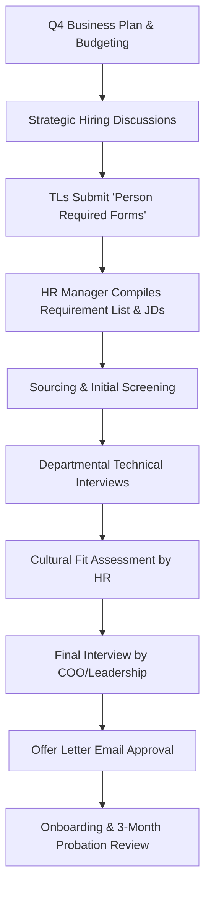

# Operational Documentation: Human Resources (HR) & Talent Management

## Department Snapshot

### Time & Effort Split
* **Recruitment Sourcing & Candidate Screening:** ~40% (estimated from coordinating 60–80 interviews, preparing Job Descriptions, and sourcing candidates)
* **Performance Management (PMS) & Appraisals:** ~25% (estimated from annual appraisals and manager coordination)
* **Onboarding, Offboarding & Policy Administration:** ~20% (estimated from managing Zoho People, Zoho Payroll, resignations, and policy approvals)
* **Learning & Development (L&D) Operations:** ~15% (estimated from ad-hoc training research and planning)

### Tool Stack
* **HR Records & Employee Profiles:** Zoho People (using Zia virtual assistant)
* **Payroll Processing:** Zoho Payroll
* **Hiring Pipeline Sourcing:** Google Sheets & Google Forms (manual logs)
* **Operational Approvals:** Email (Gmail) for external approvals (e.g., offer letters), Zoho People for internal policy compliance

### Key Frequency & Volume Metrics
* **Hiring Cycle Cadence:** Planned in **Q4** based on the yearly Business Plan (stated directly)
* **Active Recruitment Target:** **18–20** positions yet to be finalized (stated directly)
* **Selection Funnel Volume:** **60–80** interviews conducted per hiring cycle (stated directly)
* **Interview Duration:** **30–40 minutes** average per interview (stated directly)
* **Increment & Resignation Discussions:** Major discussion once a year for the **2nd line of heads** (stated directly)
* **Performance Probation:** **3-month** post-joining evaluation conducted by HR and the reporting manager (stated directly)

### Red Flags
1. **High**: *Lack of Unified Applicant Tracking & Visibility* — The recruitment pipeline relies on independent Google Sheets and Google Forms. This creates a visibility gap for CXO/Leadership, who lack a high-level overview/dashboard of hiring progress from sourcing to onboarding.
2. **High**: *Siloed Onboarding & Process Automation* — Upon hiring a candidate, there is no automated handoff. Employee profiles, L&D tracks, document submission workflows, KPI assignments, and exit protocols are not automatically provisioned, requiring manual data setup across platforms.
3. **Medium**: *Manual Approval Bottlenecks* — Offer letter validations and policy approvals are processed via unstructured email threads. This is compounded by Team Leads submitting resource requests via manual "Person Required Forms" over email.
4. **Medium**: *Subjective and Infrequent Appraisals* — Performance management is tied to annual discussions (especially for direct reports with the COO), which lacks integration with real-time KPI data. Sales target tracking and operational performance are not automated or linked to appraisals.
5. **Low**: *Ad-hoc L&D Infrastructure* — Training research and L&D requests are handled randomly without a formal submission portal, standard assessment forms, or a skills inventory database ("who knows what skills") to target development needs.

---

## 1. Operational Profile & Scope
* **Department/Business Unit:** Human Resources (HR) — manages recruitment, employee database records, payroll compliance, performance appraisals, company policy enforcement, and training program research.
* **Team Structure & Scope:**
  * **HR Head (Dolly Mehta):** Directs HR strategy, executes hiring plans, manages payroll data, and enforces policy compliance.
  * **Team Leads (All Departments):** Submit recruitment requests and participate in technical screening/interviewing.
  * **COO Office (Puran Singh Rajput):** Collaborates on strategic Q4 hiring, defines financial allocations, conducts final candidate interviews, and approves offer letters.

---

## 2. Team Structure & Effort Distribution

### Personnel & Alignment
The HR department is headed by Dolly Mehta. The operations align closely with department Team Leads for sourcing/interviews and the COO for strategy and final approvals.

### Effort & Time Allocation
* **Recruitment Logistics:** Sourcing resumes, coordinating and conducting 60–80 interviews, preparing requirement lists, and routing Job Descriptions (JDs) for direct reports.
* **Administrative Approvals:** Managing Zoho People workflows, processing Zoho Payroll, and handling annual increments and resignation processing for secondary leadership lines.
* **Performance Management (PMS):** Coordinating annual reviews and probation check-ins.
* **Training & Research:** Reviewing occasional training requests and searching for training resources on an ad-hoc basis.

---

## 3. Yearly Recruitment Planning & Interview Workflow

### Process Sequence
1. **Strategic Planning:** Sourcing targets are established in Q4 based on the yearly Business Plan. Strategic discussions define financial allocations for headcount.
2. **Requisition Stage:** Department Team Leads fill out a manual "Person Required Form" and share it with the HR team. The HR Head compiles the list of hiring requirements and gathers Job Description (JD) details (specifically for direct reports).
3. **Screening & Interviews:** Candidates are sourced and screened. Depending on the department, technical interviews are conducted.
   * *Selection Ratio:* 60–80 interviews (30–40 min average duration) must be conducted to hire and finalize **18–20** positions (stated directly).
4. **Final Selection & Offer:** HR conducts cultural fit assessments. Final interviews are taken by the COO/Leadership.
5. **Approval & Onboarding:** Offer letters are approved via email. Upon joining, a 3-month performance evaluation is scheduled to be conducted by HR and the respective department manager.

---

## 4. Performance Management System (PMS) & Appraisals
* **Current Appraisal Process:** The system relies on annual discussions based on the PMS (for direct reporting personnel with the COO).
* **Increment & Resignation Review:** Major discussions regarding increments and resignations for the **2nd line of heads** (secondary management layer) are held once a year.
* **System Gaps:** The department needs to shift PMS reviews to a **monthly** cadence. Appraisals are not connected to live performance data; the team aims to automatically track performance and pull sales targets directly into the review workflow.

---

## 5. Learning & Development (L&D) Operations
* **Current Process:** L&D and training research are conducted occasionally on an ad-hoc, "randomly required" basis.
* **Key Requirements & Gaps:**
  * **Recurring Feedback Loop:** Need to establish a recurring feedback loop to capture training requests from all teams.
  * **Request Management Portal:** Need a system where employees or Team Leads can submit structured requests for training.
  * **Standardization:** Need standardized assessment forms to measure training efficacy.
  * **Skills Matrix Directory:** Build a central profile registry/skills matrix ("know who knows some skills") to match skillsets and identify training gaps.
  * **Engagement:** Introduce gamified elements to encourage participation and tracking in learning programs.

---

## 6. Onboarding, Offboarding & Policy Administration
* **Policy Compliance:** General company policy approvals are managed. Processes are currently hosted on Zoho People (using Zia virtual assistant) and processed in Zoho Payroll.
* **Communication Bifurcation:** Internal processes and approvals are maintained within the system (Zoho People), whereas external communication (e.g., candidate communication, external vendor terms) is handled via email.
* **Onboarding Integration Needs:** Need a unified system that tracks candidates from recruitment to onboarding (managing offer letters and NDA signing). Upon joining, the employee record should automatically initialize their L&D track, exit process blueprints, compliance documents, and assigned KPIs.

---

## 7. Cross-Department Dependencies

| Target Department | Nature of Dependency | Frequency / Impact |
|---|---|---|
| **All Team Leads** | Submitting "Person Required Forms" for new headcount, contributing JD details, conducting initial technical interviews, and providing L&D feedback. | Continuous / Sourcing cycles |
| **COO Office (Puran Sir)** | Aligning Q4 hiring budgets, conducting final interviews, approving offer letters on email, and managing annual PMS for direct reports. | Strategic planning / Per-hire basis |
| **Finance & Accounts** | Reconciling payroll files, auditing expense claims, and validating salary disbursement budgets. | Monthly |

---

## 8. Operational Friction & Bottlenecks (Audit Analysis)
*Documented under the Red Flags section at the top of this report.*

---

## 9. Audit Backlog & Follow-Up Items
* **Applicant Tracking System (ATS) Selection:** Evaluate platforms to bridge the hiring-to-joining gap, focusing on integrated NDA signing, email offer approvals, and automatic onboarding profile generation.
* **Zoho People Monthly PMS Configuration:** Research options within Zoho People to support monthly appraisal cadences linked to real-time KPI fields (e.g., sales targets).
* **Skills Inventory Database Design:** Design the schema/structure for a central skills directory ("know who knows what") to optimize project and L&D allocation.
* **Standard Operating Procedures (SOP) Compilation:** Create a central repository of documented processes for key HR tasks (e.g., 2nd line increments, resignation handlings, and policy exceptions) to move away from email-based documentation.
