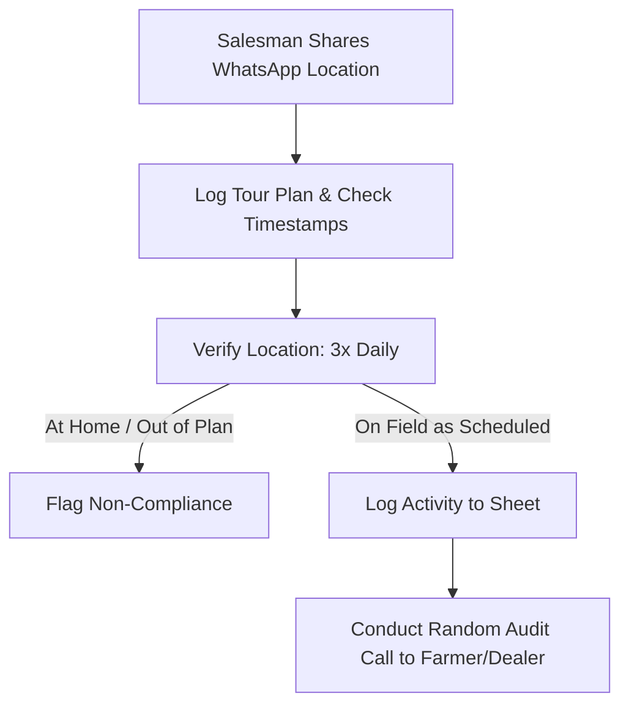

# Operational Documentation: Marketing & Retail Sales

## Department Snapshot

### Time & Effort Split
* **Field Force Location & Activity Tracking:** ~30% (estimated)
* **On-Ground Verification & Customer Calling:** ~25% (estimated)
* **Sales Targets & Zoho Actuals Reconciliation:** ~20% (estimated)
* **Data Entry & Media Sorting:** ~15% (estimated)
* **Marketing Collateral & Social Media Planning:** ~10% (estimated)

### Tool Stack
* **Tracking & Databases:** Google Sheets (MIS Sales Plans, Marketing Master Sheet, Social Planner), Google Drive (for field photos)
* **Accounting & Reconciliation:** Zoho Books (used to extract sales value, quantity, and payment reports)
* **Operational Comms:** WhatsApp (dominant; location sharing, tour plans, payment receipts, hand-written PO photos), phone calls, Email
* **Social Media Platforms:** LinkedIn, Facebook, Instagram

### Key Frequency & Volume Metrics
* **Salesman Tracking Cadence:** **3 times/day** location checks (stated directly)
* **Sales Planning Window:** Monthly targets (MIS Sales Plan) mapped by state, district, distributor, and person (stated directly)
* **Audit Video Context:** **27 minutes** review meeting (stated directly)

### Red Flags
1. **High**: *Manual Field Geolocation Tracking* — Field force tracking relies on salesmen manually sharing WhatsApp locations which are checked against a database of home addresses three times a day, consuming significant staff time.
2. **High**: *Inefficient Sales Actuals Extraction* — Reconciling target sales against actuals requires manual extraction of customer-wise reports from Zoho Books, resulting in a lag in pipeline visibility.
3. **Medium**: *Analog PO and Quotation Verification* — Field salesmen draft quotations and POs on paper and share photos over WhatsApp, requiring manual entry into accounting systems.
4. **Medium**: *Friction-Prone Payment Confirmations* — Customer payments are validated via WhatsApp screenshots and manual coordination with the Accounts team, risking delay in release authorizations.
5. **Low**: *Siloed Marketing Collateral Audits* — Printed marketing stock (brochures, flyers) is managed in separate sheets without automated minimum levels, risking collateral stockouts.

---

## 1. Operational Profile & Scope
* **Department/Business Unit:** Marketing & Retail Sales — manages brand marketing, social media scheduling, field force compliance tracking, sales planning, and regional dealer/farmer relationships.
* **Core Sales Channel:** Retail-focused channel involving Regional Sales Managers (RSMs), field area managers, on-ground salesmen, and direct farmer dispatches.
* **Activity Focus:** Real-time tracking of salesman field itineraries, verification of dealer/farmer meetings, and executing the monthly Management Information System (MIS) Sales Plan.

---

## 2. Team Structure & Hierarchy

### Personnel & Role Demarcation
The department has a distinct operational separation between marketing planning and field tracking functions:
* **Department Lead (Gaurav Jain):** Directs sales planning, oversees the monthly MIS target mapping, and reviews budget allocations.
* **Marketing Coordinator (Vandana Jain):** Manages the monthly social planner, executes social media postings, and maintains the Marketing Master Sheet for printed collaterals.
* **Field Tracker & Quality Executive (Kamakshi Sankhla):** Tracks salesman locations, inputs farmer contact sheets, uploads field media to Drive directories, and conducts verification calls.
* **On-Ground Field Force:** Consists of Regional Sales Managers (RSMs), field sales executives, and direct-to-farmer representatives.

### Effort & Time Allocation
* **Field Geolocation Verification:** ~6–8 hours/day (inferred from tracking live locations of salesmen three times daily and mapping them against home boundaries).
* **Customer Verification Calls:** ~5–6 hours/day (inferred from conducting confirmation calls to farmers and dealers to verify meetings logged in spreadsheets).
* **Target vs. Actual Reconciliation:** ~3–4 hours/week (inferred from manually pulling customer-wise invoice records from Zoho Books to update target tracking).
* **Media Management & Data Entry:** ~1.5–2.5 hours/day (inferred from extracting names/numbers from WhatsApp chat files and sorting photos to Drive).
* **Social Scheduling & Collateral Audits:** ~4–6 hours/week (inferred from coordinating print vendor MOQs and scheduling LinkedIn/Facebook/Instagram calendars).

---

## 3. Field Force Geolocation & Compliance Workflow

### Tracking & Auditing Sequence
1. **Tour Plan Intake:** Field salesmen submit daily travel schedules (Tour Plans) over WhatsApp groups.
2. **Location Auditing:** Salesmen share live locations via WhatsApp. The Compliance Executive monitors these locations three times daily, cross-referencing them against known home coordinates to verify field attendance.
3. **Meeting Logging:** Ground activities (dealer check-ins, farmer assemblies) are logged based on text reports and photos sent by salesmen.
4. **Physical Media Sorting:** Field photos and crop inspection records are copied from WhatsApp and uploaded to designated Google Drive folders.
5. **Data Enrichment:** Customer names, phone numbers, districts, and villages are extracted from WhatsApp reports and entered into the master tracking sheets.
6. **Interaction Verification:** The Compliance Executive places phone calls to the farmers or dealers checked in the sheet to confirm the salesmen physically visited the site and discussed product dosage.

---

## 4. Sales Target & Reconciliation Workflow
* **MIS Planning Structure:** The sales target matrix (MIS Plan) is compiled monthly. Targets are mapped state-wise, district-wise, representative-wise, and distributor-wise.
* **Actuals Reconciliation Gaps:** Zoho Books does not natively display physical quantities (tonnage/SKUs) sold alongside cash receipts in a consolidated dashboard. Reconciling targets requires the team to log in to Zoho Books, pull customer-wise sales reports, manually identify invoice values, and match them against the sales sheet.
* **Payment Clearance Loop:** Payment receipts are shared by salesmen as screenshots on WhatsApp. The sales lead verifies these payments against bank records or coordinates with the Accounts team for confirmation before authorizing logistics to release shipments.

---

## 5. Marketing Master Sheet & Social Planning
* **Social Media Planner:** Vandana Jain maintains a monthly scheduling spreadsheet. Posts (incorporating event highlights, crop results, or holiday greetings) are planned and posted across LinkedIn, Facebook, and Instagram.
* **Collateral Stock Tracking:** The Marketing Master Sheet tracks inventory levels of printed materials (brochures, banners, flyers, promotional items) held at Udaipur or factory depots.
* **Outbound Collateral Distribution:** Field executives submit requests for brochures and promotional items. The marketing team checks stock levels and coordinates dispatches.

---

## 6. Tooling & Information Systems Context
* **System Integration Limits:** Google Sheets and Zoho Books operate as disconnected systems. Target parameters (MIS Plans) and actual billing figures must be reconciled manually.
* *Refer to the Tool Stack in the snapshot at the top of this report for system listings.*

---

## 7. Cross-Department Dependencies

| Target Department | Nature of Dependency | Frequency / Impact |
|---|---|---|
| **Finance / Accounts** | Verifying bank clearings for incoming payments and processing travel claims. | Daily |
| **Logistics** | Coordinating dispatches once PO and payment clearances are confirmed. | Transactional (per PO) |
| **Production** | Syncing custom branding packaging prints with marketing assets. | Project-based |

---

## 8. Operational Friction & Bottlenecks (Audit Analysis)
*Documented under the Red Flags section at the top of this report.*

---

## 9. Audit Backlog & Follow-Up Items
* **WhatsApp Data Extraction Automation:** Research WhatsApp API or parsing tools (e.g., automated forms or chatbots) to eliminate manual copy-pasting of farmer contact data.
* **Zoho Books Actuals API Sync:** Investigate methods to extract customer-wise sales quantity and value data from Zoho Books directly into the MIS tracking sheet.
* **Digital PO Creation:** Evaluate mobile order intake forms for field salesmen to replace hand-written paper quotations and PO screenshots.
* **Marketing Collateral Reorder Triggers:** Establish automated minimum stock alarms in the Marketing Master Sheet to prevent collateral shortages during field campaigns.
