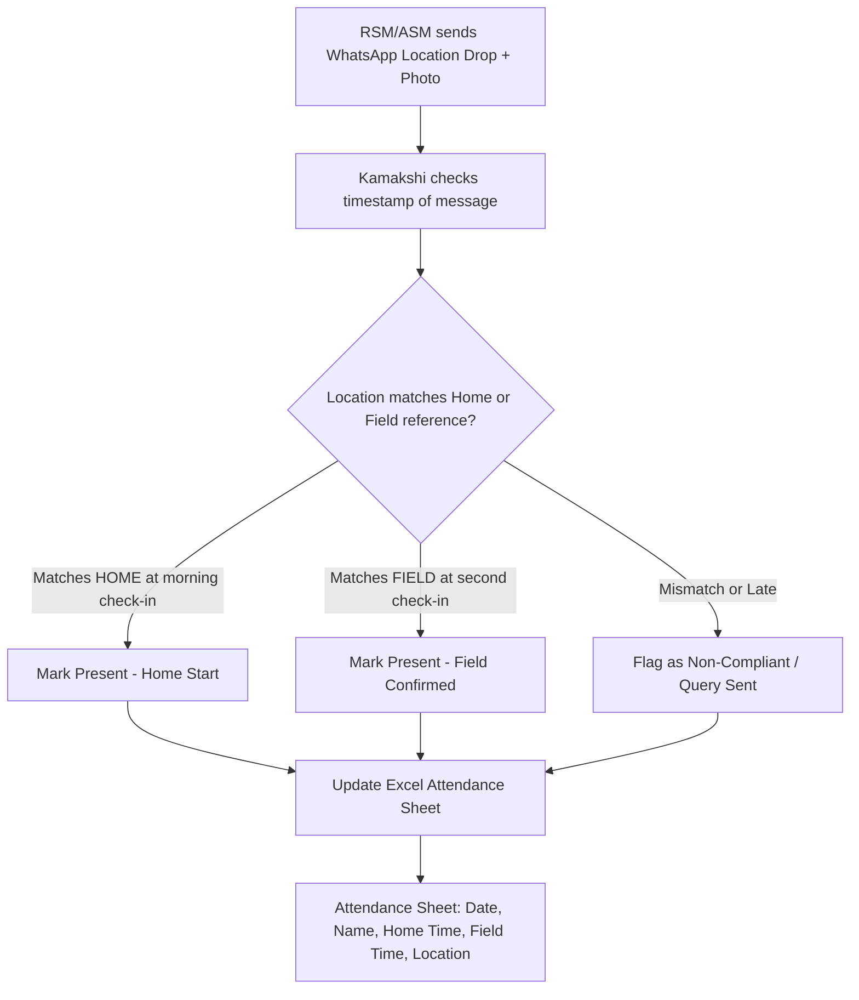
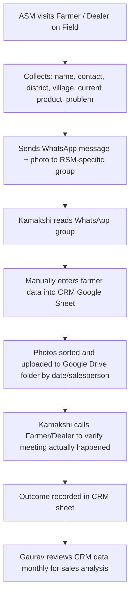
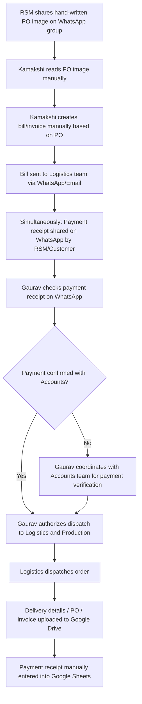
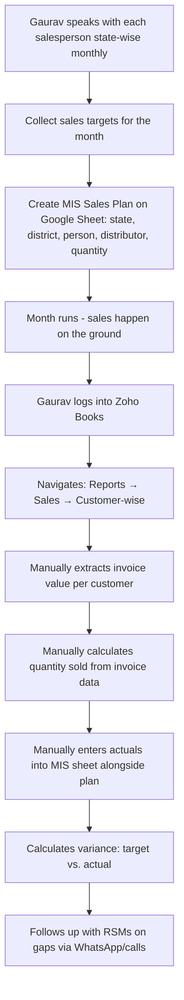

# Operational Documentation: Marketing & Retail Sales
**Interviewees:** Gaurav Jain (Marketing & Retail Sales Head), Vandana Jain (Marketing Coordinator), Kamakshi Sankhla (Field Tracker & Quality Executive)
**Interview Date:** June 10

---

## Department Snapshot

### Time & Effort Split
* **Field Force Location & Attendance Tracking:** ~30% (estimated — 3x daily manual location checks against home/field coordinates)
* **On-Ground Verification & CRM Calling:** ~25% (estimated — inbound data extraction from WhatsApp + outbound verification calls to farmers/dealers)
* **Sales Targets & Zoho Actuals Reconciliation:** ~20% (estimated — manual extraction from Zoho Books + PO-to-bill creation)
* **Data Entry, Media Sorting & PO Creation:** ~15% (estimated — WhatsApp → Google Sheets/Drive transfer, receipts/invoices upload)
* **Marketing Collateral & Social Media Planning:** ~10% (estimated — social calendar, vendor coordination, stock tracking)

> **Key Operational Note (stated directly):** The two internal team members (Vandana and Kamakshi) have completely separate functions. Vandana handles social media/marketing planning; Kamakshi handles field tracking and CRM. There is no functional overlap or internal link between their workflows.

### Tool Stack
* **Tracking & Databases:** Google Sheets (MIS Sales Plans, Marketing Master Sheet, Social Media Planner, CRM/Farmer Data, Attendance, Payment Receipts, Stock Management — all separate sheets)
* **File Storage:** Google Drive (field photos, PO images, invoices, payment receipts — uploaded manually)
* **Accounting & Reconciliation:** Zoho Books (used to extract customer-wise sales value, quantity, and payment reports — read-only for this team)
* **Operational Comms:** WhatsApp (dominant; 10,000+ real-time updates across multiple group structures — location sharing, tour plans, payment receipts, hand-written PO photos, farmer meeting outcomes, order confirmations, dispatch details)
* **Social Media Platforms:** LinkedIn, Facebook, Instagram (managed separately, no unified analytics platform)
* **External Coordination:** Email (accounts/logistics escalations, invoices to accounts team)

### Key Frequency & Volume Metrics
* **Salesman Tracking Cadence:** **3 times/day** location checks (home check-in, field departure, field check-in)
* **Sales Planning Cadence:** Monthly MIS Sales Plan, mapped by state → district → distributor → salesperson
* **WhatsApp Traffic:** **10,000+ real-time updates** across all groups (payments, shipping, farmer meetings, attendance)
* **Team Scale:** 1 Marketing Head + 1 Marketing Coordinator + 1 Field Tracker; supported by multiple RSMs and multiple ASMs in the field
* **Audit Video Context:** **27-minute** review meeting

### Red Flags
1. **High** — *WhatsApp Information Overload & Forced Manual Entry* — All operational data (locations, payments, POs, meeting outcomes, dispatch details) flows exclusively through WhatsApp groups. A dedicated team member must manually transfer all of this to Google Sheets and Google Drive daily — creating lag, human error risk, and single-point-of-failure dependency.
2. **High** — *No Centralized Sales Dashboard* — There is no real-time dashboard. Gaurav must manually navigate Zoho Books, pull customer-wise invoice/payment reports, manually calculate quantities, and match them to the MIS plan sheet to understand current vs. target sales.
3. **High** — *Manual Attendance Tracking via WhatsApp Photos & Locations* — RSMs and ASMs mark attendance by sending WhatsApp photos and location drops at specific times. A team member reads these, checks the timestamp, matches the location against known home/field coordinates stored in a reference file, and manually updates the Excel sheet.
4. **Medium** — *Analog PO → Bill Creation Loop* — Field salesmen share hand-written PO images on WhatsApp. The internal team member reads the PO, creates the bill manually, and sends it to the logistics and accounts teams. This is a slow, error-prone, and non-auditable process.
5. **Medium** — *Payment & Dispatch Coordination is Fully WhatsApp-Dependent* — All payment receipts (from customers/RSMs), confirmation of payment clearance (from accounts), and dispatch authorization (to production/logistics) happen over WhatsApp and email, with no structured handoff or tracking system.
6. **Medium** — *Zoho Books Quantity Gap* — Zoho Books shows invoice value but does not provide a direct quantity-wise consolidated view. The team has to navigate multiple customer reports and manually aggregate quantities to understand how much product has actually been sold vs. targeted.
7. **Low** — *Siloed Marketing Collateral & Social Media Analytics* — Marketing materials (banners, brochures) and product material stock are managed in separate sheets with no automated reorder triggers. Social media has no unified analytics platform; performance is tracked manually.

---

## 1. Operational Profile & Scope
* **Department/Business Unit:** Marketing & Retail Sales — manages brand marketing, social media scheduling, field force compliance and attendance tracking, sales planning, regional dealer/farmer CRM, and coordination with accounts/logistics for order fulfillment.
* **Core Sales Channel:** Retail-focused channel (RSM → ASM → Dealer/Farmer). Not direct B2B or institutional — this is ground-level retail agricultural product sales.
* **Farmer Journey:** RSMs and ASMs visit farmers, collect data about their problems, current product usage, and present EF Polymer products. This data flows back to the marketing team via WhatsApp.
* **Activity Focus:** Real-time monitoring of salesman field activity, farmer and dealer CRM maintenance, MIS Sales Plan tracking against Zoho Books actuals, and social media brand building.

---

## 2. Team Structure & Hierarchy

### Personnel & Role Demarcation

| Role | Name | Primary Responsibilities |
|---|---|---|
| **Marketing & Retail Sales Head** | Gaurav Jain | Directs sales planning, MIS targets, monitors all WhatsApp groups, payment/dispatch authorization, cross-department coordination |
| **Marketing Coordinator** | Vandana Jain | Monthly social media calendar, posting across platforms, external vendor coordination, marketing material stock management |
| **Field Tracker & Quality Executive** | Kamakshi Sankhla | Salesman location/attendance tracking (3x daily), farmer CRM data entry from WhatsApp, Drive media uploads, PO-to-bill creation, verification calls |
| **Regional Sales Managers (RSMs)** | Multiple | Manage ASMs, share tour plans, visit dealers/farmers, send PO images and payment receipts on WhatsApp |
| **Area Sales Managers (ASMs)** | Multiple | Ground-level farmer meetings, collect farmer data (problems, products in use), share locations and meeting outcomes on WhatsApp |

> **Critical note (stated directly):** Vandana and Kamakshi's work is completely separate. There is no internal link between their workflows. The separation is: Vandana = brand/marketing, Kamakshi = field operations/tracking.

### Effort & Time Allocation

| Task | Assigned To | Estimated Daily/Weekly Time |
|---|---|---|
| Field geolocation verification & attendance | Kamakshi | ~6–8 hrs/day |
| Farmer/dealer CRM data entry from WhatsApp | Kamakshi | ~2–3 hrs/day |
| Verification calls to farmers/dealers | Kamakshi | ~2–3 hrs/day |
| PO reading, bill creation, Drive uploads | Kamakshi | ~1–2 hrs/day |
| Target vs. actual reconciliation (Zoho Books) | Gaurav | ~3–4 hrs/week |
| WhatsApp payment monitoring & dispatch auth | Gaurav | ~1–2 hrs/day |
| Social media calendar & posting | Vandana + Vendor | ~4–6 hrs/week |
| Marketing collateral & stock management | Vandana | ~2–3 hrs/week |

---

## 3. WhatsApp Group Structure

The team operates across **multiple WhatsApp groups** serving different purposes. This is the current information architecture:

| Group Type | Members | Content Shared |
|---|---|---|
| **RSM-Specific Groups** | 1 RSM + their ASMs | Tour plans, field location drops, meeting notes, farmer data, PO images |
| **Main Marketing Group** | Marketing Head + all RSMs + ASMs | Payment receipts, shipping details, farmer meeting photos, location shares, attendance |
| **Accounts Coordination** | Marketing Head + Accounts team | Payment confirmation, receipt verification, invoice submission |
| **Logistics Coordination** | Marketing Head + Logistics team | Dispatch orders, PO handoffs, delivery confirmations |

> **Key pain point (stated directly):** All information — from attendance to payments to POs to farmer data — is scattered across these groups. Kamakshi manually monitors all groups and extracts data into sheets.

---

## 4. Field Force Attendance & Geolocation Workflow

### Tracking Sequence (Stated Directly by Kamakshi)
1. **Reference Data Setup:** Kamakshi maintains a reference file with each salesperson's registered home location coordinates (collected during onboarding).
2. **Check-In 1 (Morning):** RSM/ASM sends WhatsApp location from home before leaving. Kamakshi logs the timestamp and verifies coordinates against the home reference.
3. **Check-In 2 (Field Departure/Arrival):** RSM/ASM shares a second location drop upon reaching the field location. This is compared to the planned tour destination.
4. **Check-In 3 (During Field Visit):** A mid-day location/photo confirmation is sent from the field, along with activity notes.
5. **Manual Sheet Update:** Kamakshi manually records home time, field time, location match status, and overall attendance for each salesperson in the Excel attendance sheet.

> **The entire 3x daily tracking process is done manually by one person (Kamakshi) for all RSMs and ASMs.**

---

## 5. Farmer Data Collection & CRM Workflow

### Data Points Collected Per Farmer Visit (Stated Directly)
- Farmer name
- Contact number
- District
- Village
- Current product in use
- Problem/pain point
- Outcome of conversation
- Visit photo (uploaded to Drive)

---

## 6. PO → Bill → Dispatch Workflow

### Key Issues in This Flow
- **No structured handoff format** — POs arrive as WhatsApp photos; there is no digital order form.
- **Manual bill creation** — Kamakshi reads a hand-written PO and creates a bill independently, with no validation layer.
- **Payment reconciliation is WhatsApp-driven** — Gaurav has to monitor WhatsApp for payment screenshots, then separately verify with the Accounts team, then authorize logistics — all via informal messages.
- **Receipts and invoices are uploaded to Drive manually** — no automated document capture or naming convention enforced.

---

## 7. Sales Target & MIS Reconciliation Workflow

### Stated Pain Points
- Zoho Books shows invoice value but **not physical quantity** in a consolidated view — quantity must be manually calculated from invoice line items.
- There is **no automated notification** when a new sale is logged in Zoho Books.
- There is **no single dashboard** where Gaurav can see: this month's plan vs. actual, by state/district/person, in real time.
- Reconciling one month's data requires navigating Zoho Books, pulling customer reports, and manually matching to sheets — taking several hours per cycle.

---

## 8. Marketing & Social Media Planning Workflow

### Social Media Calendar (Vandana Jain)

| Activity | Tool | Frequency |
|---|---|---|
| Monthly content calendar creation | Google Sheets | Monthly |
| Post planning (events, farmer results, product highlights) | Google Sheets | Monthly |
| Content design | External vendor | Per post |
| Posting to LinkedIn, Facebook, Instagram | Manual (Vandana) | Per scheduled post |
| Analytics review | No single platform (checked per platform individually) | Ad hoc |

> **Stated directly:** There is no single analytics dashboard. Each platform's insights are checked separately. There is no unified view of social media performance.

### Marketing Collateral & Stock Management (Vandana Jain)

| Item | Tracking Method | Reorder Trigger |
|---|---|---|
| Brochures, banners, flyers | Google Sheets (Marketing Master Sheet) | Manual check — no automated alert |
| Promotional items | Google Sheets (Marketing Master Sheet) | Manual check — no automated alert |
| Product material stock (for RSMs/ASMs) | Separate Excel sheet | Manual check — requests via WhatsApp |

- RSMs and ASMs request product material stock — requests come via WhatsApp.
- Stock levels are checked manually in the Excel sheet.
- **No automated reorder triggers or minimum stock alerts.**

---

## 9. Tooling & Information Systems Context

### System Integration Gaps

| System | Current Use | Integration Gap |
|---|---|---|
| **WhatsApp** | Primary comms for everything | No API integration; all data extracted manually by Kamakshi |
| **Google Sheets (MIS)** | Monthly sales target tracking | Not connected to Zoho Books; actuals entered manually |
| **Google Sheets (CRM)** | Farmer/dealer contact database | Populated manually from WhatsApp messages |
| **Google Sheets (Attendance)** | Daily salesperson attendance | Updated manually from WhatsApp location drops |
| **Google Sheets (Payments)** | Payment receipts log | Updated manually from WhatsApp payment screenshots |
| **Google Sheets (Stock)** | Collateral & product material stock | No alerts; checked manually on request |
| **Google Drive** | Photo and document storage | Manual upload; no auto-sync from WhatsApp |
| **Zoho Books** | Sales invoices and payments | No direct export or API to Sheets; manual extraction only |

> **Stated directly by Gaurav:** *"WhatsApp integration, the sheet, and then a dashboard — that's what I want. A dashboard which integrates Zoho Books at the back-end with the sheets."*

---

## 10. Cross-Department Dependencies

| Target Department | Nature of Dependency | Trigger | Frequency / Impact |
|---|---|---|---|
| **Finance / Accounts** | Payment receipt verification before dispatch authorization | RSM shares payment screenshot on WhatsApp | Daily / High |
| **Logistics** | Dispatch coordination after PO-to-bill conversion and payment clearance | Manually sent bill + authorization message | Transactional (per PO) |
| **Production** | Quantity and SKU dispatch instructions based on retail channel orders | Order intake from RSM WhatsApp | Per order / High |

---

## 11. Operational Friction & Bottlenecks Summary

| # | Friction Point | Root Cause | Impact |
|---|---|---|---|
| 1 | Manual attendance tracking (3x daily for all RSMs/ASMs) | No automated geolocation system | ~6–8 hrs/day of Kamakshi's time |
| 2 | WhatsApp → Google Sheets data transfer (farmer CRM) | No WhatsApp-to-Sheets API | ~2–3 hrs/day of Kamakshi's time |
| 3 | No real-time sales dashboard | Zoho Books and Sheets are disconnected | Gaurav has no live view of targets vs. actuals |
| 4 | Manual PO reading and bill creation | POs are hand-written and shared as photos | Dispatch delay; bill error risk |
| 5 | Payment confirmation via WhatsApp | No payment gateway or automated reconciliation | Delayed dispatch authorization; accounts lag |
| 6 | No unified social media analytics | Each platform checked separately | No data-driven content decisions |
| 7 | Manual collateral stock management | Separate Excel sheet, no alerts | Risk of running out of field materials |

---

## 12. Suggested Solutions & Audit Backlog Items

### Priority 1 — WhatsApp AI Knowledge Hub (Core Need)
Create an AI bot embedded in all WhatsApp groups that:
- **Automatically extracts** farmer data (name, contact, district, village, problem, product) from messages and populates the CRM Google Sheet.
- **Auto-uploads** photos and documents (PO images, payment receipts, visit photos) to the correct Google Drive folder with structured naming.
- **Detects location shares and timestamps** to automatically mark attendance (home vs. field) in the attendance sheet.
- **Parses payment receipt messages** and updates the payment tracking Google Sheet in real time.

### Priority 2 — Centralized Sales Dashboard
Build a single dashboard (connected to Google Sheets + Zoho Books) that shows:
- **Real-time MIS progress:** Target vs. actual by state, district, person, and distributor.
- **Monthly and quarterly progress bars** with remaining target values.
- **Payment status** per RSM/ASM.
- **Automated notifications** when a new Zoho Books sale is logged (closing the gap vs. plan).

### Priority 3 — Digital PO & Order Intake Form
Replace hand-written PO images with a structured mobile form for RSMs/ASMs:
- Pre-filled customer details from CRM.
- Digital quotation generation.
- Direct submission to accounts and logistics on approval — no manual bill creation required.

### Priority 4 — Zoho Books API Integration
- Automate extraction of customer-wise sales quantity and value from Zoho Books into the MIS tracking sheet.
- Trigger notifications to Gaurav when a new invoice is created.

### Priority 5 — Unified Social Media Analytics & Collateral Alerts
- Set up a single social media analytics tool (e.g., Meta Business Suite or a third-party tool) to consolidate Instagram, Facebook, and LinkedIn performance.
- Add automated minimum stock alerts to the collateral tracking sheet to prevent field material shortages during campaigns.
