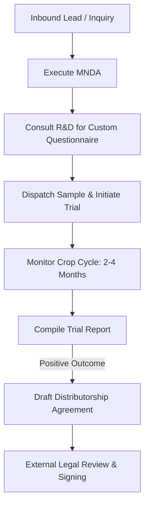

# Operational Documentation: MENA & International Sales

## Department Snapshot

### Time & Effort Split
* **Logistics & Export Execution Coordination:** ~30% (estimated)
* **Lead Qualification & Inbound Follow-up:** ~25% (estimated)
* **Trial Alignment & R&D Coordination:** ~20% (estimated)
* **Contract Administration & Legal Routing:** ~15% (estimated)
* **Pipeline Logging & Tracker Updates:** ~10% (estimated)

### Tool Stack
* **Tracking & Pipelines:** Shared Google Sheets (Logistics Tracker, Customer Stage Tracker)
* **Comms & Video Meetings:** Email (Gmail), Slack (Middle East accounts), WeChat (China), WhatsApp (India backups), Google Meet, MS Teams, Zoom

### Key Frequency & Volume Metrics
* **Crop Trial Sowing-to-Harvest Cycle:** **2–4 months** (stated directly)
* **Purchase Order Data Completeness:** ~**90%** standard fields correct (stated directly)
* **International Dispatch Preparation Time (20ft):** **1 week** minimum (stated directly)

### Red Flags
1. **High**: *Single-Point Logistics Constraint* — International dispatches depend entirely on a single Logistics Manager (Nihal) who is shared across domestic and B2B segments, risking shipping delays during peak cycles.
2. **Medium**: *Ineffective Outbound Sales Funnel* — Cold outreach via email and LinkedIn has very low conversion rates, leaving global revenue reliant on inbound inquiries.
3. **Medium**: *Delayed Remittance Alerts* — Cross-border bank receipts do not trigger instant alerts in Zoho Books, requiring manual advance warnings from BD to prevent dispatch holds.
4. **Low**: *Personal Phone Dependency* — Client relationships in the Middle East and China are maintained on a personal phone number, risking loss of account contacts upon employee exit.

---

## 1. Operational Profile & Scope
* **Department/Business Unit:** MENA & International Sales — a distinct business unit focused on B2B international distributor management.
* **Geographical Scope:** Asia, Africa, and expanding operations into Australia.
* **Core Product:** EF Polymer (export formulation).
* **Sales Channel:** Distributor/Importer-led model (direct factory sales to regional distributors, who manage localized sales to large agricultural corporations). Direct B2B accounts are managed in parallel.

---

## 2. Team Structure & Effort Distribution

### Personnel & Reporting Lines
* **BD Manager - International Sales (Neha Pathak):** Directs global distributor accounts, manages sales agreements, coordinates cross-department execution, and acts as the Customer SPOC. Reports directly to Puran Singh Rajput (COO) (stated directly).
* **Management Trainee (Sheetal):** Supports lead nurturing, documentation, and administrative operations (recently joined).

### Effort & Time Allocation
* **Logistics & Export Compliance Coordination:** ~6–10 hours per container shipment (inferred from coordinating the two-stage factory-to-port and port-to-destination freight).
* **Trial Alignment & Questionnaire Setup:** ~2–3 hours per target trial (inferred from consulting R&D for custom questionnaires and tracking parameters).
* **Contract Administration & Legal Routing:** ~4–6 hours per distributor contract (inferred from drafting, external legal review cycles, and execution).
* **Inbound Lead Qualification:** ~4–6 hours/week (inferred from manual assessment of media-driven inquiries).
* **Shared Sheet Maintenance:** ~1–2 hours/week (inferred from maintaining the logistics and customer-stage dashboards).

---

## 3. Customer Interaction & SPOC Model
* **Single Point of Contact (SPOC) Policy:** The BD Manager serves as the sole customer interface. Production, Logistics, and Accounts do not contact the customer directly. All requirements, invoices, and shipment updates are routed through the BD Manager to maintain customer experience.
* **Communication Access:**
  * **Device Inconsistency:** International Sales operates on a single personal phone number for both personal and professional communications.
  * **Channel Adaptation:** Slack is prioritized for Middle East corporate accounts; WeChat is used for China; WhatsApp is used for Indian regional buyers. Email is reserved for contractual and invoicing transactions.

---

## 4. Client Onboarding & Trial Lifecycle

### Process Sequence
1. **Confidentiality:** Mutual Non-Disclosure Agreements (MNDA) must be signed before sharing technical data.
2. **Trial Design:** BD consults R&D to obtain crop-specific technical questionnaires tailored to local regional parameters. dosage calculators calibrated for Indian conditions are not used for international trials.
3. **Execution:** Samples are shipped for trial runs. Crop cycles average **2–4 months** from sowing to harvest (stated directly).
4. **Review & Reporting:** Trial results are compiled and presented to the customer.
5. **Commercial Onboarding:** BD drafts the Distributorship Agreement, routes it to an external legal consultant for review, and executes the contract.

---

## 5. Commercial Order & Shipping Logistics
* **White-Labeling MOQ Policy:** White-label packaging (custom client branding) is restricted to large container orders that meet minimum print-run thresholds. Small-volume orders are shipped under standard EF Polymer branding.
* **Invoice Verification:** Purchase Orders (POs) are routed to Accounts for billing. Approximately **90%** of customer POs arrive complete on the first submission (stated directly). Occasional manual corrections are required for billing/shipping address mix-ups.
* **Logistics Execution:** The Logistics team owns cargo movement from the factory to the Indian departure port, including container loading and customs clearances. BD coordinates shipping agents for port-to-destination transit.

---

## 6. Tooling & Information Systems Context
* **Shared Pipeline Transparency:** The department utilizes shared Google Sheets:
  * **Logistics Tracker:** Managed by the Logistics team (Nihal), allowing BD to check container status without manual query.
  * **Customer Stage Tracker:** Maintained by BD, allowing COO leadership to review account stages directly.
* *Refer to the Tool Stack in the snapshot at the top of this report for system listings.*

---

## 7. Cross-Department Dependencies

| Target Department | Nature of Dependency | Frequency / Impact |
|---|---|---|
| **Production** | Verifying component inventory and manufacturing lead times. | Transactional (per order) |
| **Logistics (Nihal)** | Factory dispatch, port clearance, and customs documentation. | Continuous / Critical for SLA |
| **R&D (Ritu)** | Creating custom trial parameters and verifying crop cycle data. | Per-trial onboarding |
| **Accounts** | Invoice generation and tracking international payment receipts. | Daily during billing windows |
| **Legal (External)** | Contract compliance reviews for MNDAs and distribution agreements. | Ad-hoc (hourly billing) |

---

## 8. Operational Friction & Bottlenecks (Audit Analysis)
*Documented under the Red Flags section at the top of this report.*

---

## 9. Audit Backlog & Follow-Up Items
* **Logistics SLA Capacity Audit:** Interview Nihal Paliwal to evaluate workload allocation and identify bottlenecks in customs document preparation.
* **R&D Test Turnaround Times:** Cross-reference R&D timelines for custom international trial parameter generation.
* **Cross-Border Payment Alerts:** Research automated cross-border remittance notification options within Zoho Books or local bank APIs.
