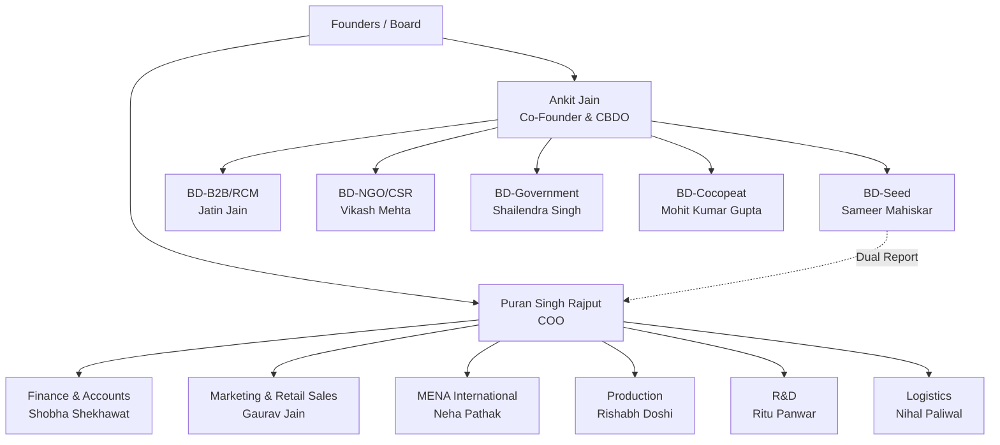
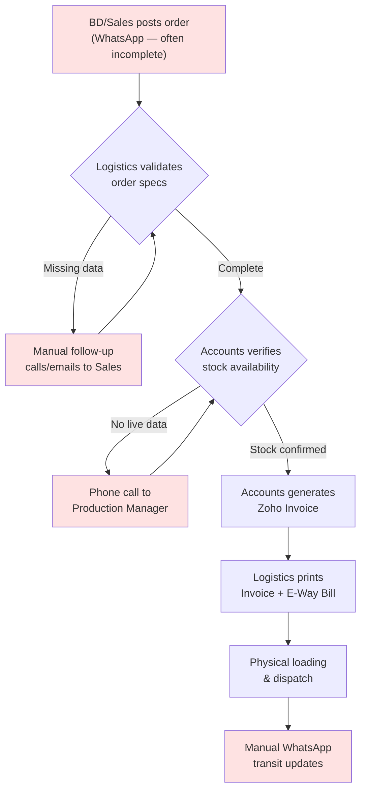

# EF Polymers — Enterprise Operational Audit Report

**Prepared by:** Creative Upaay Consulting  
**Date:** July 2026  
**Version:** 1.0  
**Classification:** Confidential — Executive Leadership Only  
**Methodology:** Enterprise Business Transformation Consulting Framework v1.0  
**Departments Audited:** 12 (R&D, Production, Logistics, Accounts, Marketing/Retail Sales, BD-Cocopeat, BD-NGO/CSR, BD-Seed, BD-B2B/RCM, MENA International Sales, COO Office, CBDO Office)

---

## Table of Contents

1. [Executive Summary](#1-executive-summary)
2. [Company Profile & Business Model](#2-company-profile--business-model)
3. [Organizational Structure](#3-organizational-structure)
4. [Department Maturity Scorecard](#4-department-maturity-scorecard)
5. [Enterprise Maturity Heatmap](#5-enterprise-maturity-heatmap)
6. [Cross-Department Dependency Map](#6-cross-department-dependency-map)
7. [Consolidated Red Flags & Risk Register](#7-consolidated-red-flags--risk-register)
8. [Operational Truth Gaps](#8-operational-truth-gaps)
9. [Technology Landscape Assessment](#9-technology-landscape-assessment)
10. [Data Flow & Governance Assessment](#10-data-flow--governance-assessment)
11. [Workflow Bottleneck Analysis](#11-workflow-bottleneck-analysis)
12. [AI & Automation Readiness Assessment](#12-ai--automation-readiness-assessment)
13. [Strategic Recommendations](#13-strategic-recommendations)
14. [Transformation Roadmap](#14-transformation-roadmap)
15. [Appendix: Audit Coverage Matrix](#15-appendix-audit-coverage-matrix)

---

## 1. Executive Summary

### 1.1 Audit Scope & Approach

This report consolidates findings from **12 department-level operational audits** conducted across EF Polymers (EFP), a bio-polymer manufacturing company specializing in agricultural soil-moisture-retention products and cocopeat growing media. The audit covered the entire organizational value chain — from R&D and Production through Sales, Business Development, Finance, Logistics, Marketing, and executive leadership (COO & CBDO offices).

The methodology applied follows a six-layer thinking model (Understanding → Relationships → Constraints → Failure → Optimization → Transformation) with evidence-backed conclusions rated by confidence level.

### 1.2 Key Findings at a Glance

| Dimension | Assessment | Confidence |
|---|---|---|
| **Overall Business Maturity** | Level 2 — Developing | High |
| **Process Standardization** | Level 1.5 — Initial/Developing | High |
| **Technology Utilization** | Level 2 — Developing (Zoho underutilized) | High |
| **Data Governance** | Level 1 — Initial (spreadsheet-dependent) | Confirmed |
| **Sales Operations** | Level 1 — Initial (no CRM) | Confirmed |
| **Automation Readiness** | Level 1.5 — Emerging | High |
| **AI Readiness** | Level 1 — Not Ready (data fragmentation) | High |
| **Scalability Readiness** | Level 1.5 — Critical constraints at 2× growth | High |

### 1.3 Critical Observations

1. **No Central CRM exists.** All 5 BD verticals + MENA + Marketing/Retail operate on disconnected spreadsheets, WhatsApp, and personal memory. This is the single largest operational risk.
2. **Spreadsheet Dependency is systemic.** An estimated **30+ independent Excel/Google Sheets** serve as primary operational databases across the organization, with zero integration.
3. **Key-Person Dependencies are pervasive.** R&D (Ritu Panwar), Logistics (Nihal Paliwal), and Finance (Shobha Shekhawat) each represent single points of failure for critical business functions.
4. **WhatsApp is the de facto ERP.** Order intake, field tracking, payment confirmations, customer communication, and even PO submissions flow through WhatsApp groups with no data capture or audit trail.
5. **COGS is unreliable.** Monthly margin volatility of 50%–77% due to absent WIP valuation, no grade-based costing, and unallocated packaging/depreciation costs renders financial reporting unreliable.

```
VISUALIZATION: Radar/Spider Chart
Title: "EF Polymers — Enterprise Maturity Overview"
Dimensions (8 axes, scale 1–5):
  - Process Standardization: 1.5
  - Technology Utilization: 2.0
  - Data Governance: 1.0
  - Sales & CRM: 1.0
  - Financial Accuracy: 1.5
  - Knowledge Management: 1.5
  - Automation Maturity: 1.5
  - Scalability Readiness: 1.5
Overlay: Industry benchmark line at 3.0 (mid-maturity)
```

---

## 2. Company Profile & Business Model

### 2.1 Business Overview

| Attribute | Detail |
|---|---|
| **Company** | EF Polymers (EFP) |
| **Industry** | Agri-tech / Bio-polymer Manufacturing |
| **Core Product** | Bio-polymer soil moisture retention granules |
| **Secondary Product** | Cocopeat (coconut husk soil-less growing media) |
| **Revenue Model** | B2B manufacturing + white-label + export + retail |
| **Manufacturing** | Udaipur (primary), Coimbatore (secondary / cocopeat) |
| **Markets** | India (pan-national), Middle East, Europe, Japan, USA, Africa, Australia |
| **Product Shelf Life** | 3 years |
| **Estimated Headcount** | 40–50+ personnel (across all departments) |

### 2.2 Revenue Channels

| Channel | Description | Key Account/Vertical |
|---|---|---|
| **Retail (D2C/Dealer)** | Multi-tier distribution via RSMs → Dealers → Farmers | Marketing & Retail Sales |
| **B2B White-Label** | Component supply to corporate partners | RCM (Jatin Jain) |
| **Institutional (Seed)** | Seed coating sales to seed companies & universities | Sameer Mahiskar |
| **NGO/CSR** | Bulk contracts with NGOs and CSR programs | Gaurav Dwivedi / Vikash Mehta |
| **Government** | State/federal procurement tenders | Shailendra Singh |
| **International Export** | Distributor-led B2B across MENA, Asia, Africa | Neha Pathak |
| **Cocopeat Export** | Container-load exports of soil-less media | Mohit Kumar Gupta |
| **D2C Japan (Planned)** | Website-based direct-to-consumer launch | Mohit / Yoshida-san |

### 2.3 Product Complexity Matrix

| Dimension | Variants |
|---|---|
| **Granule Sizes** | <2mm (India), 2–4mm, 1.18–1.41mm (international) |
| **SKU Sizes** | 50g, 100g, 200g, 500g, 1kg, 5kg, 20–25kg, 100kg, bulk sacks (1000–1400kg) |
| **Packaging Languages** | Hindi, English, Spanish, French, Japanese + custom |
| **Product Grades** | A, B, C (different quality tiers) |
| **Cocopeat Formats** | Open-top grow bags, cocopit grow bags, 5kg blocks, pellets/coins |
| **Custom Blends** | Perlite, NPK formulations per client spec |

> **Operational Implication:** This multi-variable product matrix (granule size × SKU × language × grade × blend) creates significant packaging procurement complexity and inventory management burden, evidenced by the 68% surplus pouch problem reported by Production.

---

## 3. Organizational Structure

### 3.1 Leadership & Reporting Lines



### 3.2 Headcount Distribution

| Department | Personnel | Status |
|---|---|---|
| **R&D** | 4 active + 2 incoming + interns | Expanding |
| **Production** | 3 core + 4 recent hires | Recently expanded |
| **Logistics** | 2 FTE | Lean / at capacity |
| **Finance & Accounts** | 3 FTE | Stable |
| **Marketing & Retail Sales** | 3 office + field RSMs | Under-resourced |
| **BD-Cocopeat** | 4 active (Mohit, Ishwarya, Rajesh, Yoshida) | Stable |
| **BD-NGO/CSR** | 4 active + 1 vacant | Hiring |
| **BD-Seed** | 1 active + 1 planned hire | Under-resourced |
| **BD-B2B/RCM** | 7 active → 10 planned | Expanding |
| **MENA International** | 2 (Neha + 1 MT) | Lean |
| **COO Office** | 1 + oversight | — |
| **CBDO Office** | 1 + oversight | — |

> **Key Risk:** BD-Seed operates as a **solo single-point operation** for a pan-India institutional vertical with a 90 MT annual target.

---

## 4. Department Maturity Scorecard

> Scores are based on the 5-level maturity model (1=Initial, 2=Developing, 3=Standardized, 4=Managed, 5=Optimized). Evidence references are drawn from individual department audits.

| Department | Process | Technology | Data Quality | Documentation | Knowledge Mgmt | Overall |
|---|---|---|---|---|---|---|
| **R&D** | 2.0 | 2.0 | 1.5 | 2.5 | 1.5 | **2.0** |
| **Production** | 2.5 | 2.0 | 2.0 | 2.0 | 2.0 | **2.0** |
| **Logistics** | 2.0 | 1.5 | 1.5 | 1.5 | 2.0 | **1.5** |
| **Finance & Accounts** | 2.5 | 3.0 | 2.0 | 2.0 | 2.5 | **2.5** |
| **Marketing / Retail Sales** | 1.5 | 1.0 | 1.0 | 1.5 | 1.0 | **1.0** |
| **BD — Cocopeat** | 2.0 | 1.5 | 1.5 | 2.0 | 1.5 | **1.5** |
| **BD — NGO/CSR** | 1.5 | 1.0 | 1.0 | 1.5 | 1.0 | **1.0** |
| **BD — Seed** | 1.0 | 1.0 | 1.0 | 1.0 | 1.0 | **1.0** |
| **BD — B2B/RCM** | 2.0 | 1.5 | 1.5 | 1.5 | 1.5 | **1.5** |
| **MENA International** | 2.0 | 1.5 | 2.0 | 2.0 | 1.5 | **2.0** |
| **COO Office** | 2.0 | 2.0 | 1.5 | 2.0 | 2.0 | **2.0** |
| **CBDO Office** | 1.5 | 1.0 | 1.0 | 1.5 | 1.0 | **1.0** |
| **Enterprise Average** | **1.9** | **1.6** | **1.5** | **1.7** | **1.5** | **1.7** |

```
VISUALIZATION: Grouped Horizontal Bar Chart
Title: "Department Maturity Scorecard"
X-Axis: Maturity Score (1–5)
Y-Axis: Department names (12 departments)
Bars per department: Process (blue), Technology (green), Data Quality (orange), Documentation (purple), Knowledge Mgmt (red)
Reference Line: Enterprise average at 1.7
Color coding: Scores ≤1.5 = red, 1.5–2.5 = amber, ≥2.5 = green
```

---

## 5. Enterprise Maturity Heatmap

| Category | Current Score | Target Score (12-mo) | Gap | Confidence |
|---|---|---|---|---|
| Leadership & Governance | 2.5 | 3.5 | 1.0 | High |
| Strategy Alignment | 2.0 | 3.0 | 1.0 | High |
| Sales Operations | 1.0 | 3.0 | 2.0 | Confirmed |
| Customer Lifecycle | 1.5 | 3.0 | 1.5 | High |
| Operational Excellence | 2.0 | 3.0 | 1.0 | High |
| Process Standardization | 1.5 | 3.0 | 1.5 | High |
| Documentation | 1.7 | 3.0 | 1.3 | High |
| Knowledge Management | 1.5 | 2.5 | 1.0 | High |
| Technology Landscape | 2.0 | 3.5 | 1.5 | High |
| Data Quality | 1.5 | 3.0 | 1.5 | Confirmed |
| Reporting & Analytics | 1.5 | 3.0 | 1.5 | High |
| Automation Readiness | 1.5 | 2.5 | 1.0 | High |
| AI Readiness | 1.0 | 2.0 | 1.0 | High |
| Compliance Readiness | 2.0 | 3.0 | 1.0 | Medium |
| Financial Operations | 2.0 | 3.5 | 1.5 | Confirmed |
| Scalability | 1.5 | 3.0 | 1.5 | High |
| Change Readiness | 2.0 | 3.0 | 1.0 | Medium |
| Customer Experience | 2.0 | 3.0 | 1.0 | Medium |
| **Overall Business Maturity** | **1.7** | **3.0** | **1.3** | **High** |

```
VISUALIZATION: Maturity Heatmap (Matrix/Grid)
Title: "Enterprise Maturity Assessment — Current vs. Target"
Rows: 18 categories listed above
Columns: Current Score, Target Score, Gap
Cell Color Coding:
  - 1.0–1.5: Deep Red (#DC2626)
  - 1.5–2.0: Orange (#F59E0B)
  - 2.0–2.5: Amber (#FBBF24)
  - 2.5–3.0: Light Green (#84CC16)
  - 3.0+: Green (#16A34A)
Gap column: Color intensity proportional to gap size
```

---

## 6. Cross-Department Dependency Map

### 6.1 Critical Dependency Matrix

| Source → Target | Nature | Frequency | Risk Level |
|---|---|---|---|
| All BD Verticals → **Logistics** | Dispatch, freight, customs | Daily | 🔴 Critical |
| All BD Verticals → **Accounts** | Invoicing, payment verification | Per-shipment | 🔴 Critical |
| All BD Verticals → **R&D** | Technical data, trial reports, dosage | Per-pitch/trial | 🟡 Medium |
| All BD Verticals → **Production** | Stock availability, lead times | Per-order | 🟡 Medium |
| **Marketing** → **Accounts** | Payment verification, dispatching | Daily | 🟡 Medium |
| **Logistics** → **Accounts** | Invoice generation pre-dispatch | Per-shipment | 🔴 Critical |
| **Logistics** → **Production** | Manufacturing completion dates | Daily | 🔴 Critical |
| **Accounts** → **Production** | Stock availability (manual phone) | Per-invoice | 🔴 Critical |
| **R&D** → **Production** | Lab-to-commercial formulation handoff | Project-based | 🟡 Medium |
| **R&D** → **QC** | Daily QC Tracker co-management | Daily | 🟡 Medium |
| **COO** → **All Departments** | Approvals, reporting, oversight | Continuous | 🟡 Medium |
| **CBDO** → **All BD Verticals** | Pipeline reviews, strategic alignment | Monthly | 🟡 Medium |

### 6.2 Dependency Risk Concentration

```
VISUALIZATION: Network/Force-Directed Graph
Title: "Cross-Department Dependency Network"
Nodes: 12 departments (sized by number of inbound dependencies)
Edges: Directional arrows showing dependency relationships
Edge Thickness: Proportional to frequency (daily = thick, monthly = thin)
Edge Color: Red = critical risk, Amber = medium risk, Green = low risk
Highlight Nodes: Logistics, Accounts, Production (highest inbound dependency counts)
Key Insight: Logistics (Nihal, 2 FTE) and Accounts (3 FTE) are convergence points for all commercial operations
```

> **Systemic Bottleneck Identified:** Logistics (2 FTE) and Accounts (3 FTE) are the operational convergence points for **all** revenue-generating activities. Every BD vertical, Marketing, and international sales must route through these two departments for order fulfillment.

---

## 7. Consolidated Red Flags & Risk Register

### 7.1 Severity Summary

| Severity | Count | Breakdown |
|---|---|---|
| 🔴 **High** | 14 | CRM absence, data fragmentation, key-person dependencies, financial opacity |
| 🟡 **Medium** | 14 | Follow-up gaps, manual processes, dual reporting, communication risks |
| 🟢 **Low** | 8 | Collateral tracking, community drop-off, late-night decision capture |
| **Total** | **36** | Across 12 departments |

### 7.2 Critical Risk Register (High-Severity Items)

| # | Risk | Department(s) | Root Cause | Business Impact | Evidence |
|---|---|---|---|---|---|
| R01 | **No Central CRM** — Pipeline, lead ownership, and deal stages invisible at executive level | CBDO, All BD, MENA | No system of record adopted; each vertical uses ad-hoc spreadsheets | Revenue leakage, ownership conflicts, missed follow-ups | CBDO, BD-Seed, BD-NGO/CSR audits: confirmed zero CRM |
| R02 | **COGS Margin Volatility (50%–77%)** — Untraceable monthly cost swings | Accounts | No WIP valuation, no grade-based costing, unallocated packaging costs, no asset register | Financial reporting unreliable, investor confidence risk | Accounts audit: stated directly |
| R03 | **Key-Person Dependency: R&D** — Protocol approvals, grant writing, technical sign-offs bottlenecked on PD Manager | R&D | Single qualified authority for multi-geography compliance | Regulatory delays, trial backlogs if Ritu unavailable | R&D audit: stated directly |
| R04 | **Key-Person Dependency: Logistics** — Single logistics manager shared across domestic + export + B2B | Logistics, MENA, All BD | Only 2 FTE for all shipment types | Export SLA breaches, demurrage fees | Logistics & MENA audits |
| R05 | **Disconnected Zoho WMS** — Custom WMS siloed from Zoho Books ERP | Production, Accounts | System built independently; no API link to ERP | Manual reconciliation, inaccurate cost auditing | Production audit: stated directly |
| R06 | **CargoX Gating Bottleneck** — Export docs gated behind payment clearance with 10-day upload window | BD-Cocopeat | Finance approval dependency on international remittance | Demurrage fees, customer relationship damage | BD-Cocopeat audit: stated directly |
| R07 | **Manual Field Geolocation Tracking** — WhatsApp-based location sharing checked 3×/day manually | Marketing/Retail | No automated field force management app | 6–8 hrs/day staff time consumed | Marketing audit: stated directly |
| R08 | **Surplus Custom Packaging** — 68% packaging surplus from MOQ constraints | Production | Printer MOQ (16K) vs. order size (5K) mismatch | Warehouse cost, write-off exposure on design changes | Production audit: stated directly |
| R09 | **WhatsApp Order Intake** — Incomplete order specs via WhatsApp text | Logistics | No structured order intake form | Shipment delays, manual follow-up overhead | Logistics audit: stated directly |
| R10 | **No Real-Time Stock Visibility** — Accounts cannot check inventory before invoicing | Accounts, Production | Zoho Inventory not exposing live stock to billing | Manual phone calls per invoice, billing delays | Accounts audit: stated directly |
| R11 | **Scattered R&D Data** — Research across 8–10 disconnected spreadsheets | R&D | No centralized research database | Redundant testing, data loss, repeat trial costs | R&D audit: stated directly |
| R12 | **Manual GST/TDS Reconciliation** — 1–2 weeks per tax cycle | Accounts | Manual portal-to-Books matching | 30–40 hrs/month compliance overhead | Accounts audit: stated directly |
| R13 | **Tertiary Sales Invisibility (RCM)** — Zero data below depot tier across 10,000 retail stores | BD-B2B/RCM | No API or data sharing with RCM retail layer | Demand planning blind spot, inventory risk | B2B/RCM audit: stated directly |
| R14 | **Data Security / Contact Continuity** — ~90% of communications on personal WhatsApp numbers | BD-B2B/RCM, MENA | No company-owned SIMs or business number policy | Customer relationship loss on employee exit | B2B/RCM & MENA audits |

```
VISUALIZATION: Risk Impact vs. Likelihood Matrix (Bubble Chart)
Title: "Enterprise Risk Register — Impact vs. Likelihood"
X-Axis: Likelihood (1=Unlikely, 5=Certain)
Y-Axis: Business Impact (1=Low, 5=Critical)
Bubbles: Each of the 14 high-severity risks (R01–R14)
Bubble Size: Proportional to number of departments affected
Bubble Color: Red = financial impact, Orange = operational, Blue = strategic
Quadrant Labels: Top-Right = "Immediate Action", Top-Left = "Monitor Closely", Bottom-Right = "Quick Fix", Bottom-Left = "Accept"
Expected Clustering: R01, R02, R04, R05 in top-right "Immediate Action" quadrant
```

---

## 8. Operational Truth Gaps

The audit identified significant divergence between documented/stated processes and actual operational behavior:

| Area | Stated/Intended Process | Actual Observed Process | Gap Type |
|---|---|---|---|
| **Order Intake** | Structured PO with complete specs → billing → dispatch | WhatsApp text with missing fields → manual chase for pin codes, GSTIN, packaging specs | Shadow Process |
| **Inventory Management** | Zoho Inventory as system of record | Manual phone calls to Production Manager; weekly stock sheets in Google Sheets | Duplicate System |
| **Sales Pipeline** | Vertical leads track pipeline stages | Memory-based follow-ups every 4–5 days from unstructured spreadsheets | Tribal Knowledge |
| **Field Compliance** | Mobile app-based geolocation tracking | WhatsApp location sharing + manual address cross-referencing 3×/day | Shadow Process |
| **Payment Confirmation** | Zoho Books bank reconciliation | WhatsApp screenshot of payment receipt → manual verification call to Accounts | Shadow Process |
| **Project Management** | Asana (adopted then abandoned) | Reverted to Excel spreadsheets | Tool Abandonment |
| **COGS Calculation** | System-computed cost of goods | Manual spreadsheet averaging without WIP, grade-based, or overhead allocation | Process Gap |
| **Customer Master Data** | Shared customer database | Accounts, Sales, and Logistics each maintain separate records; repeated data requests | Data Duplication |
| **Export Documentation** | Integrated invoicing + shipping | Zoho Books + manual logistics spreadsheet (disconnected) | System Fragmentation |
| **Marketing ROI** | Budget-to-outcome tracking | No ROI tracking; budget approved without measurable conversion metrics | Missing Process |

---

## 9. Technology Landscape Assessment

### 9.1 Current Technology Inventory

| System | Category | Owner | Users | Utilization | Integration |
|---|---|---|---|---|---|
| **Zoho Books** | Accounting/ERP | Finance | Accounts, Logistics, Marketing | Moderate | Bank feeds (auto); no live inventory link |
| **Zoho Inventory** | Inventory Mgmt | Finance | Accounts, Production | Low | Linked to Books but lacks grade-based costing |
| **Zoho Expense** | Expense Mgmt | Finance | All employees | Moderate | 3-level approval flow active |
| **Zoho Payroll** | Payroll | Finance | HR/Finance | Moderate | Linked to Zoho People |
| **Zoho People** | HRMS | Finance | HR/Finance | Low | — |
| **Custom Zoho WMS** | Warehouse Mgmt | Production | Production | In-progress | ❌ Disconnected from Zoho Books |
| **Google Sheets** | Tracking (everything) | All departments | Everyone | Overextended | ❌ No integrations |
| **Google Drive** | Document Storage | R&D, Marketing | R&D, Field teams | Moderate | Manual upload only |
| **WhatsApp** | Communications | All | All | Overextended (de facto ERP) | ❌ No data capture |
| **Gmail** | Email | All | All | Standard | — |
| **Slack** | Internal comms | Select teams | BD-B2B, MENA | Low–Moderate | — |
| **Power BI** | Dashboarding | R&D | R&D (onboarding) | Emerging | Not yet connected |
| **Google Ads** | Paid acquisition | BD-Cocopeat | Marketing, BD | Active | ❌ No CRM integration |
| **LinkedIn Ads** | Paid acquisition | BD-Cocopeat | Marketing, BD | Active | ❌ No CRM integration |
| **CargoX** | Export compliance | BD-Cocopeat | Logistics, BD | Active | Manual upload |
| **Contactout / Apollo** | Lead enrichment | BD-NGO/CSR | BD | Ad-hoc | — |
| **Dripify** | LinkedIn automation | BD-Cocopeat | BD | ❌ Subscription lapsed | — |
| **Canva** | Design/Proposals | BD-NGO/CSR | BD | Active | — |
| **Field Tracking App** | Sales compliance | COO | Field RSMs | Partial (network issues) | — |

### 9.2 Technology Maturity Assessment

| Dimension | Score (1–5) | Evidence |
|---|---|---|
| Cloud Adoption | 2.5 | Zoho suite is cloud-based; most data still in local spreadsheets |
| System Integration | 1.0 | Zoho WMS disconnected from Books; Sheets disconnected from everything |
| Data Accessibility | 1.5 | Data trapped in 30+ spreadsheets and personal devices |
| Process Digitization | 1.5 | Paper POs, WhatsApp photos, paper field diaries |
| Reporting Capability | 1.5 | No live dashboards; Power BI in early onboarding |
| API Readiness | 1.5 | Zoho has APIs but none are utilized |
| **Digital Maturity Index** | **1.6 — Emerging** | — |

```
VISUALIZATION: Technology Architecture Diagram (Block Diagram)
Title: "EF Polymers — Current Technology Ecosystem"
Layers:
  1. Communication Layer: WhatsApp (dominant), Email, Slack, WeChat, LINE
  2. Operational Layer: Google Sheets (30+ trackers), Google Drive, Paper diaries
  3. Business Applications: Zoho Books, Zoho Inventory, Zoho Expense, Zoho Payroll, Zoho People, Custom Zoho WMS
  4. Marketing/Sales: Google Ads, LinkedIn Ads, Dripify (lapsed), Contactout, Apollo, Canva
  5. Compliance: CargoX, Field Tracking App
  6. Analytics: Power BI (onboarding)
Connections: Show broken links (❌) between Zoho WMS ↔ Zoho Books, Sheets ↔ Zoho Books, WhatsApp ↔ Any System
Color: Red borders for disconnected systems, green for connected
```

### 9.3 Key Technology Gaps

| Gap | Impact | Recommended Action |
|---|---|---|
| **No CRM** | Pipeline invisible; revenue leakage | Implement Custom React JS CRM (unified across all BD verticals) |
| **Zoho WMS ↔ Books disconnect** | Manual cost reconciliation | API integration or rebuild within Zoho ecosystem |
| **No structured order intake** | Shipment delays from incomplete data | Digital order form integrated with Zoho |
| **No real-time inventory visibility** | Phone-call-based stock checks | Zoho Inventory live API to Accounts |
| **No automated field tracking** | 6–8 hrs/day manual compliance | Zoho FSM or equivalent with GPS auto-tracking |
| **No knowledge base** | Research data fragmented across 8–10 sheets | Centralized R&D database with version control |
| **No marketing analytics** | Zero ROI on ad spend | UTM tracking + Zoho Analytics integration |

---

## 10. Data Flow & Governance Assessment

### 10.1 Data Flow Architecture (Current State)

```
VISUALIZATION: Sankey / Flow Diagram
Title: "EF Polymers — Data Flow Architecture (Current State)"
Data Sources (Left):
  - Field Teams (WhatsApp photos, text, locations)
  - Customers (POs via email/WhatsApp, payment screenshots)
  - Production Floor (manual QC logs, stock sheets)
  - Vendors (MOQ quotes, packaging specs)
  - Ad Platforms (Google/LinkedIn leads)
Processing Layer (Middle):
  - 30+ Google Sheets (manual entry)
  - Zoho Books (invoicing)
  - WhatsApp Groups (routing)
  - Email (document exchange)
  - Paper Diaries (field data)
Consumption Layer (Right):
  - COO/CBDO (manual verbal briefings)
  - Accounts (manual reconciliation)
  - Board/Investors (PowerPoint decks from verbal data)
  - Logistics (manual dispatch sheets)
Flow Annotations: Mark all flows as "Manual" or "Semi-automated"
Highlight: No single source of truth exists for any data domain
```

### 10.2 Source of Truth Analysis

| Data Domain | Intended SoT | Actual SoT | Conflict |
|---|---|---|---|
| **Customer Master** | Zoho Books | Scattered across BD spreadsheets, WhatsApp, email | ⚠️ Multiple competing sources |
| **Inventory/Stock** | Zoho Inventory | Production Manager's personal knowledge + weekly sheets | ⚠️ No real-time source |
| **Sales Pipeline** | None designated | 5+ separate department spreadsheets | ⚠️ No SoT exists |
| **Financial (COGS)** | Zoho Books | Manual spreadsheet averaging | ⚠️ Unreliable SoT |
| **R&D Trial Data** | Google Drive | 8–10 disconnected Excel files | ⚠️ Fragmented SoT |
| **Logistics/Dispatch** | Zoho Books | Parallel manual tracking spreadsheet | ⚠️ Dual systems |
| **Employee Expenses** | Zoho Expense | WhatsApp photos + manual forwarding | ⚠️ Shadow process |
| **Field Compliance** | Field tracking app | WhatsApp location shares | ⚠️ Parallel tracking |

### 10.3 Data Quality Score

| Dimension | Score (1–5) | Key Issues |
|---|---|---|
| Accuracy | 2.0 | COGS volatility; manual transcription errors |
| Completeness | 1.5 | Missing fields in order intake; no tertiary sales data |
| Consistency | 1.0 | Same data entered differently across spreadsheets |
| Timeliness | 1.5 | Retrospective monthly reporting; no real-time dashboards |
| Uniqueness | 1.5 | Customer data duplicated across departments |
| **Overall Data Quality** | **1.5** | — |

---

## 11. Workflow Bottleneck Analysis

### 11.1 End-to-End Order Fulfillment (Current State)



### 11.2 Identified Bottlenecks

| # | Bottleneck | Location in Workflow | Estimated Time Waste | Root Cause |
|---|---|---|---|---|
| B01 | Incomplete order data from WhatsApp | Order Intake | 15–30 min per order | No structured intake form |
| B02 | Manual stock verification phone calls | Pre-Invoicing | 10–15 min per invoice | No live inventory visibility |
| B03 | Manual GST/GSTIN data lookup | Invoicing | 5–10 min per new customer | No shared customer master |
| B04 | Disconnected logistics tracking | Post-Dispatch | 20–30 min per shipment update | Zoho ↔ Sheets disconnect |
| B05 | Manual field compliance tracking | Sales Monitoring | 6–8 hours/day | No automated geo-tracking |
| B06 | Manual target vs. actual reconciliation | Sales Reporting | 3–4 hours/week | Zoho Books quantity gap |
| B07 | Paper PO → manual entry | Field Sales | 15–20 min per PO | No digital PO creation |
| B08 | WhatsApp-based payment confirmation | Payment Clearance | 10–20 min per payment | No automated bank alerts |
| B09 | Manual R&D data aggregation for board reports | Executive Reporting | 4–6 hours/month | No cross-timezone dashboard |
| B10 | Manual email-by-email cold outreach | BD Lead Generation | Hours/day per BD exec | No email automation platform |

```
VISUALIZATION: Funnel/Waterfall Chart
Title: "Order Fulfillment — Time Waste Analysis"
Stages (top to bottom):
  1. Order Intake (WhatsApp): +15-30 min waste
  2. Data Validation: +10-15 min waste
  3. Stock Check (Phone Call): +10-15 min waste
  4. Customer Data Lookup: +5-10 min waste
  5. Invoice Generation: Minimal waste
  6. Logistics Documentation: +10 min waste
  7. Transit Updates (Manual): +20-30 min waste
Total Estimated Waste per Order: 70-110 minutes
Annotations: Highlight that this compounds across 10-20 orders/day
```

---

## 12. AI & Automation Readiness Assessment

### 12.1 Automation Readiness by Workflow

| Workflow | Manual Effort | Frequency | Rule-Based | Automation Classification |
|---|---|---|---|---|
| Order intake data capture | High | Daily | Yes | ✅ Automate After Standardization |
| Invoice generation from PO | Medium | Daily | Yes | ✅ Automate Immediately (Zoho workflow) |
| Stock availability check | High | Per-invoice | Yes | ✅ Automate Immediately (Zoho API) |
| GST/TDS reconciliation | Very High | Monthly | Partially | ✅ Automate After Standardization |
| Field force geo-tracking | Very High | 3×/day | Yes | ✅ Automate Immediately (FSM tool) |
| Payment confirmation alerts | Medium | Per-payment | Yes | ✅ Automate Immediately (bank API/Zoho) |
| Cold email outreach | High | Daily | Yes | ✅ Automate Immediately (email tool) |
| Lead follow-up reminders | High | Every 4–5 days | Yes | ✅ Automate Immediately (CRM) |
| Sales target vs. actuals | High | Monthly | Yes | ✅ Automate After Standardization |
| Packaging MOQ management | Medium | Per-order | Partially | 🔍 Monitor |
| R&D data aggregation | Medium | Monthly | Partially | ✅ Automate After Standardization |
| WhatsApp data extraction | Very High | Daily | Partially | ✅ Automate After Standardization |
| Collateral reorder alerts | Low | Monthly | Yes | ✅ Automate Immediately |
| Board report compilation | High | Monthly | Partially | 🔍 Monitor |

### 12.2 AI Opportunity Register

| # | Opportunity | Department | AI Use Case | Readiness | Expected Impact |
|---|---|---|---|---|---|
| AI-01 | **Knowledge Assistant for R&D** | R&D | RAG-based search across trial data, QC results, and regulatory filings | 🟡 Ready with Constraints (data scattered) | Reduce 25% of technical query turnaround time |
| AI-02 | **Automated Lead Enrichment** | All BD | AI-powered company profiling and contact enrichment | 🟢 Ready | Replace manual Google/ChatGPT sourcing |
| AI-03 | **Email Drafting Copilot** | All BD | AI-assisted personalized cold outreach based on company context | 🟢 Ready | Increase response rate from 5% baseline |
| AI-04 | **Proposal Generation** | BD-NGO/CSR, BD-Seed | AI-generated first drafts from templates + client parameters | 🟡 Ready with Constraints (templates needed) | Reduce proposal time from 1–2.5 days to hours |
| AI-05 | **Demand Forecasting** | Production, B2B/RCM | Predictive inventory planning from historical sales data | 🔴 Not Ready (no clean historical data) | Reduce surplus packaging and stockouts |
| AI-06 | **Intelligent Document Classification** | Logistics, Accounts | Auto-classification of POs, invoices, and shipping documents | 🟡 Ready with Constraints | Reduce manual document routing |
| AI-07 | **WhatsApp Chatbot** | BD-B2B/RCM, Marketing | Automated FAQ handling, database logging, QC feedback | 🟡 Ready with Constraints | Reduce 90% community drop-off; capture data |
| AI-08 | **Meeting Summaries** | All | Auto-transcription and action item extraction from Google Meet/Zoom | 🟢 Ready | Save 2–3 hours/week per manager |
| AI-09 | **Field Photo Analysis** | Marketing, R&D | Crop health assessment from field photos | 🔴 Not Ready (no training data) | Long-term R&D value |
| AI-10 | **COGS Anomaly Detection** | Accounts | Flag unusual cost fluctuations automatically | 🟡 Ready with Constraints (need clean data first) | Early warning on margin erosion |

### 12.3 AI Readiness Summary

| Dimension | Score (1–5) | Rationale |
|---|---|---|
| Data Availability | 1.5 | Data exists but is fragmented across 30+ spreadsheets |
| Data Quality | 1.5 | Inconsistent, duplicated, manually entered |
| Process Standardization | 1.5 | Workflows are not standardized enough for reliable automation |
| Decision Standardization | 2.0 | Some rule-based decisions (QC, order routing) are standardizable |
| Human Oversight Readiness | 3.0 | Leadership receptive; CBDO has prioritized CRM |
| Governance | 1.0 | No data governance, no AI policies |
| **Overall AI Readiness** | **1.6 — Not Ready** | Process standardization and data consolidation must precede AI |

> **Recommendation:** AI initiatives should NOT be prioritized before Phase 2 of the transformation roadmap. Process standardization and CRM implementation must establish clean, accessible data foundations first.

---

## 13. Strategic Recommendations

### 13.1 Tier 1 — Foundational (Must-Do, 0–90 Days)

| # | Recommendation | Type | Impacted Depts | Priority | Expected Outcome |
|---|---|---|---|---|---|
| S01 | **Implement Custom React JS CRM** across all BD verticals, MENA, and Marketing (centralized) | Technology | All BD, MENA, Marketing, CBDO | 🔴 Critical | Unified pipeline; real-time executive visibility |
| S02 | **Integrate Zoho WMS ↔ Zoho Books** via API or rebuild | Technology | Production, Accounts | 🔴 Critical | Eliminate manual cost reconciliation |
| S03 | **Implement structured digital order intake form** (replace WhatsApp text orders) | Process | Logistics, All BD | 🔴 Critical | Reduce per-order waste by 30–45 min |
| S04 | **Enable real-time Zoho Inventory visibility for Accounts** | Technology | Accounts, Production | 🔴 Critical | Eliminate manual stock-check phone calls |
| S05 | **Establish shared Customer Master Database** in Custom React CRM | Data | Accounts, BD, Logistics | 🔴 Critical | Single source of truth for all customer data |
| S06 | **Implement grade-based WIP costing methodology** | Process/Finance | Accounts, Production | 🔴 Critical | Resolve COGS volatility |
| S07 | **Deploy automated field force tracking** (Zoho FSM or equivalent) | Technology | Marketing/Retail | 🟡 High | Recover 6–8 hrs/day of manual tracking effort |

### 13.2 Tier 2 — Operational Improvement (90–180 Days)

| # | Recommendation | Type | Priority | Expected Outcome |
|---|---|---|---|---|
| S08 | **Configure automated bank reconciliation rules** in Zoho Books | Automation | 🟡 High | Reduce GST compliance time from 2 weeks to 2–3 days |
| S09 | **Implement email automation platform** for cold outreach (separate domain) | Technology | 🟡 High | Protect primary domain; increase outreach efficiency |
| S10 | **Deploy CRM-integrated follow-up cadence** with automated reminders | Automation | 🟡 High | Eliminate memory-based lead follow-ups |
| S11 | **Create centralized R&D knowledge database** (migrate from 8–10 spreadsheets) | Data | 🟡 High | Reduce redundant testing; preserve institutional knowledge |
| S12 | **Activate Zoho asset register** for factory depreciation tracking | Finance | 🟡 High | Include depreciation in product costing |
| S13 | **Establish device/SIM ownership policy** for customer-facing roles | Governance | 🟡 High | Protect customer relationships from attrition risk |
| S14 | **Transition from paper POs to digital mobile order forms** for field salesmen | Process | 🟡 Medium | Reduce manual data entry; improve PO accuracy |

### 13.3 Tier 3 — Transformation (6–12 Months)

| # | Recommendation | Type | Priority | Expected Outcome |
|---|---|---|---|---|
| S15 | **Implement Zoho Analytics dashboards** for executive reporting | Technology | 🟡 Medium | Real-time KPIs; eliminate manual board report compilation |
| S16 | **Launch WhatsApp chatbot** for B2B/RCM community management & QC feedback | AI | 🟡 Medium | Capture structured data from 2,000+ community contacts |
| S17 | **Deploy R&D Knowledge Assistant** (RAG-based) over centralized trial database | AI | 🟡 Medium | Accelerate technical query turnaround |
| S18 | **Integrate carrier schedule APIs** for automated vessel tracking | Automation | 🟢 Low | Reduce manual ocean freight monitoring |
| S19 | **Explore RCM data-sharing integration** for store-level visibility | Data | 🟢 Low | Improve demand forecasting accuracy |
| S20 | **Evaluate packaging MOQ optimization strategy** (consortium buying or flexible printers) | Process | 🟢 Low | Reduce 68% surplus packaging waste |

---

## 14. Transformation Roadmap

### 14.1 Phased Timeline

```
VISUALIZATION: Gantt Chart / Timeline
Title: "EF Polymers — 12-Month Transformation Roadmap"
Phases (horizontal bars with milestones):

Phase 0: Preparation (Week 1–2)
  - Executive alignment workshop
  - Appoint transformation sponsor
  - Baseline current metrics

Phase 1: Quick Wins (Month 1)
  - S03: Digital order intake form
  - S04: Zoho Inventory API for Accounts
  - S07: Field force tracking deployment
  - S13: Device/SIM ownership policy

Phase 2: Operational Foundation (Months 2–3)
  - S01: Custom React JS CRM implementation (all BD verticals)
  - S05: Customer Master Database setup
  - S02: Zoho WMS ↔ Books integration
  - S06: WIP costing methodology design
  - S14: Digital mobile PO forms

Phase 3: Digital Transformation (Months 4–6)
  - S08: Automated bank reconciliation
  - S09: Email automation platform
  - S10: CRM follow-up cadences
  - S11: Centralized R&D database
  - S12: Asset register activation
  - S15: Zoho Analytics dashboards

Phase 4: Automation & AI (Months 7–12)
  - S16: WhatsApp chatbot for B2B/RCM
  - S17: R&D Knowledge Assistant
  - S18: Carrier schedule API integration
  - S19: RCM data sharing exploration
  - S20: Packaging MOQ optimization

Milestones (diamonds):
  - M1 (Month 1): Order intake digitized
  - M2 (Month 3): CRM live across all verticals
  - M3 (Month 6): Real-time executive dashboards operational
  - M4 (Month 12): AI pilots producing measurable ROI
```

### 14.2 Initiative Priority Matrix

| Initiative | Business Value | Urgency | Effort | Risk Reduction | Strategic Alignment | Overall Priority |
|---|---|---|---|---|---|---|
| S01: Custom React CRM | 10 | 10 | 6 | 9 | 10 | **P1 — Critical** |
| S02: WMS Integration | 8 | 8 | 5 | 8 | 8 | **P1 — Critical** |
| S03: Digital Order Intake | 7 | 9 | 3 | 7 | 7 | **P1 — Quick Win** |
| S04: Live Inventory | 8 | 9 | 3 | 7 | 8 | **P1 — Quick Win** |
| S05: Customer Master | 8 | 8 | 5 | 8 | 9 | **P1 — Critical** |
| S06: WIP Costing | 9 | 8 | 7 | 8 | 8 | **P1 — Critical** |
| S07: Field Tracking | 7 | 7 | 4 | 6 | 6 | **P1 — Quick Win** |
| S08: Bank Reconciliation | 6 | 6 | 4 | 5 | 6 | **P2 — High** |
| S09: Email Automation | 6 | 6 | 3 | 5 | 6 | **P2 — High** |
| S10: CRM Follow-ups | 7 | 7 | 2 | 6 | 7 | **P2 — High** |
| S11: R&D Database | 7 | 5 | 6 | 7 | 7 | **P2 — High** |
| S15: Analytics Dashboards | 7 | 5 | 5 | 5 | 8 | **P2 — Medium** |
| S16: WhatsApp Chatbot | 5 | 4 | 5 | 4 | 6 | **P3 — Medium** |
| S17: R&D AI Assistant | 6 | 3 | 7 | 5 | 7 | **P3 — Medium** |

```
VISUALIZATION: Prioritization Quadrant (Scatter Plot)
Title: "Initiative Prioritization — Impact vs. Effort"
X-Axis: Implementation Effort (1=Low, 10=High)
Y-Axis: Business Impact (1=Low, 10=High)
Quadrants:
  - Top-Left: "Quick Wins" (High impact, Low effort) — S03, S04, S07, S10
  - Top-Right: "Strategic Investments" (High impact, High effort) — S01, S02, S05, S06
  - Bottom-Left: "Low-Hanging Fruit" — S08, S09, S13, S14
  - Bottom-Right: "Long-Term Bets" — S16, S17, S19
Points: Each initiative plotted as a labeled dot
Color: Green = Phase 1, Blue = Phase 2, Purple = Phase 3, Gray = Phase 4
```

### 14.3 Success Metrics

| Phase | KPI | Baseline (Current) | Target (Post-Phase) |
|---|---|---|---|
| **Phase 1** | Order intake time per order | 70–110 min | <30 min |
| **Phase 1** | Manual stock-check calls/day | 10–15 calls | 0 (automated) |
| **Phase 1** | Field tracking manual hours/day | 6–8 hrs | <1 hr |
| **Phase 2** | Pipeline visibility (% leads tracked in CRM) | 0% | 100% |
| **Phase 2** | COGS variance month-to-month | ±27% | ±5% |
| **Phase 2** | Customer data duplication incidents/month | Unknown (frequent) | 0 |
| **Phase 3** | GST reconciliation time | 1–2 weeks | 2–3 days |
| **Phase 3** | Executive reporting prep time | 4–6 hrs/month manual | Real-time dashboard |
| **Phase 3** | Cold outreach response rate | 5% | 8–12% (email automation) |
| **Phase 4** | AI-assisted query turnaround (R&D) | 1–4 hours | <30 min |
| **Phase 4** | Community engagement rate (RCM) | 10% (200/2000) | 30%+ |

### 14.4 Governance & Change Management

| Element | Recommendation |
|---|---|
| **Executive Sponsor** | COO (Puran Singh Rajput) for operational initiatives; CBDO (Ankit Jain) for CRM and sales |
| **Program Manager** | Dedicated transformation lead (external or internal appointment recommended) |
| **Steering Cadence** | Bi-weekly executive review for Phase 1–2; monthly for Phase 3–4 |
| **Change Management** | Department-level training plans per tool rollout; champion model (1 power user per department) |
| **Risk Monitoring** | Monthly risk review against this report's register (R01–R14) |
| **Budget Model** | Prioritize existing Zoho ecosystem to minimize new licensing; phased investment aligned to quarterly revenue cycles |

---

## 15. Appendix: Audit Coverage Matrix

### 15.1 Departments Audited

| # | Department | Stakeholder Interviewed | Audit File |
|---|---|---|---|
| 1 | R&D | Ritu Panwar (PD Manager) | `production-rd-ritu-panwar-analysis.md` |
| 2 | Production Management & QC | Rishabh Doshi (Production Manager) | `production-rishabh-doshi-analysis.md` |
| 3 | Logistics | Nihal Paliwal (Logistics Manager) | `production-logistics-nihal-m-analysis.md` |
| 4 | Finance & Accounts | Shobha Shekhawat (Finance Head) | `finance-accounts-shobha-shekhawat-analysis.md` |
| 5 | Marketing & Retail Sales | Gaurav Jain (Department Lead) | `marketing-retail-sales-gaurav-jain-analysis.md` |
| 6 | BD — Cocopeat | Mohit Kumar Gupta (BD Executive) | `bd-cocopeat-mohit-kumar-analysis.md` |
| 7 | BD — NGO/CSR | Gaurav Dwivedi (BD Executive) | `bd-ngo-csr-gaurav-dwivedi-analysis.md` |
| 8 | BD — Seed | Sameer Mahiskar (BD Manager) | `bd-seed-sameer-mahiskar-analysis.md` |
| 9 | BD — B2B/RCM | Jatin Jain (AM-BD) | `company-b2b-rcm-jatin-jain-analysis.md` |
| 10 | MENA & International Sales | Neha Pathak (BD Manager) | `mena-international-sales-neha-pathak-analysis.md` |
| 11 | COO Office | Puran Singh Rajput (COO) | `cxo-operations-finance-puran-sir-analysis.md` |
| 12 | CBDO Office | Ankit Jain (CBDO / Co-Founder) | `cxo-sales-bd-ankit-sir-analysis.md` |

### 15.2 Evidence Confidence Summary

| Evidence Type | Items Used | Confidence Impact |
|---|---|---|
| Stakeholder interview transcripts | 12 | Primary evidence — High reliability |
| Tool stack declarations | 12 | Direct statements — Confirmed |
| Quantitative metrics (stated directly) | 50+ | High confidence (self-reported with cross-validation) |
| Workflow observations (mermaid flows) | 8 | Moderate confidence (derived from interviews) |
| Inferred relationships | 20+ | Medium confidence (marked as inferred) |
| Missing evidence (not audited) | Government BD vertical (Shailendra Singh), Design team, HR | Gaps reduce overall confidence by ~5% |

### 15.3 Assumptions & Limitations

1. **Government BD Vertical** (Shailendra Singh) was referenced in the CBDO audit but was not individually audited. Findings for this vertical are inferred.
2. **Design Team** was referenced in multiple audits but not directly interviewed. Capacity and workflow are estimated.
3. **Coimbatore Factory** operations were referenced by Production and Logistics but not separately audited. SOP consistency with Udaipur is assumed but unverified.
4. **Financial data** (revenue, specific budgets) was not provided. COGS analysis is based on percentage-based evidence from the Accounts audit.
5. **Employee satisfaction and retention** data was not captured in this engagement scope.

---

*This report was prepared following the Enterprise Business Transformation Consulting Framework v1.0. All findings are evidence-backed with confidence ratings. Recommendations are prioritized by business impact, feasibility, and organizational readiness. The transformation roadmap is designed for phased execution to minimize operational disruption while delivering incremental value.*

---

**Next Steps:**
1. Executive review and approval of this report
2. Prioritization alignment workshop with COO and CBDO
3. Kick-off Phase 0 — Preparation (governance, baselines, sponsor assignment)
4. Detailed CRM requirements gathering (Phase 2 planning)
