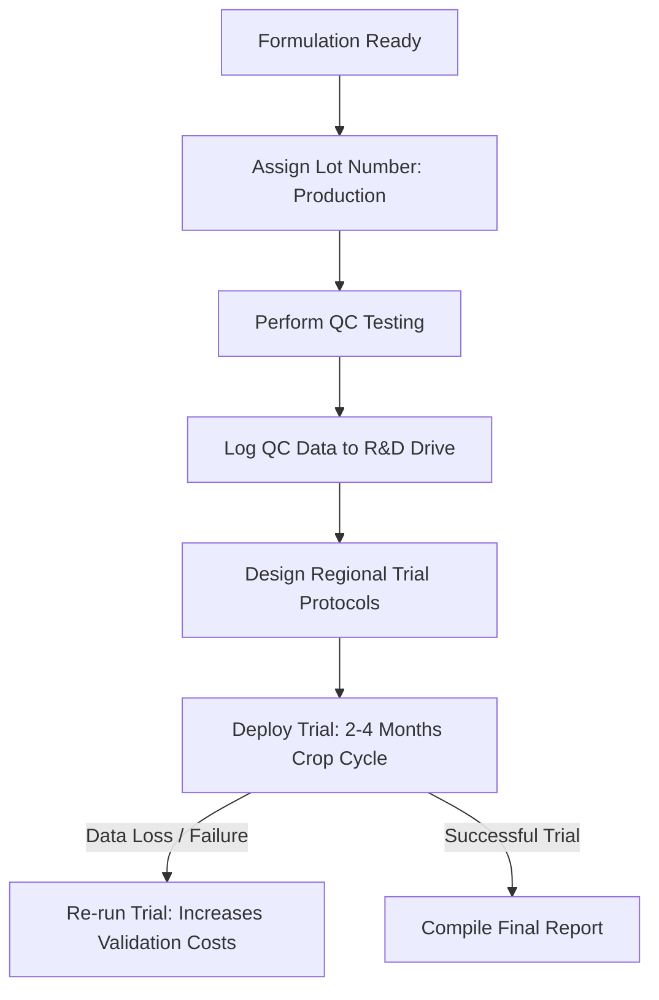

# Operational Documentation: Research & Development (R&D)

## Department Snapshot

### Time & Effort Split
* **Technical & Agronomical Report Documentation:** ~35% (estimated)
* **Excel Tracker Maintenance:** ~25% (estimated)
* **Grant & B2B Proposal Drafting:** ~20% (estimated)
* **Protocol Auditing & Approvals:** ~15% (estimated)
* **Board & BOD Reporting Prep:** ~5% (estimated)

### Tool Stack
* **Tracking & Databases:** Excel (**8–10** independent sheets; stated directly), Google Drive
* **Research & Analysis:** Wisebase/One Paper AI (topic synthesis), Google Earth Engine (scripts in progress)
* **Documentation & Comms:** Gmail, Google Docs, PowerPoint/Slides
* **Dashboarding:** Power BI (active onboarding phase)

### Key Frequency & Volume Metrics
* **Query Turnaround SLAs:** General: **1–2 hours**; Unexplored: **3–4 hours**; QC Test: **28–30 hours**; Field Trial: **2–3 months** (stated directly)
* **Active Projects:** **5–6** steady, **18–20** in peak season (stated directly)
* **Proposal Review Cadence:** Domestic: **1 week**; International: **15–20 days** with **3 review rounds** (stated directly)
* **Protocol Approval Stages:** **3-step** manual checks (stated directly)

### Red Flags
1. **High**: *Severe Key-Person Dependency* — Protocol approvals, grant writing, and technical sign-offs for India, US, EU, and Japan are bottlenecked on the PD Manager.
2. **High**: *Scattered Scientific Data* — Research findings are fragmented across **8–10** disconnected spreadsheets, causing redundant testing due to untracked results.
3. **Medium**: *Aborted Project Management Tooling* — Project tracking has reverted to manual spreadsheets after PM tools (Asana) were abandoned due to administrative overhead.
4. **Low**: *Task Ambiguity and Overload* — Lack of task load tracking for secondary support roles has led to task imbalances.

---

## 1. Operational Profile & Scope
* **Department/Business Unit:** Production (R&D) — handles new product development, chemical formulation trials, agricultural crop validation, regulatory compliance registration, and international technical documentation.
* **Geographical Scope:**
  * **India (National):** Direct on-ground trial management, university partnerships, and domestic B2B validation.
  * **Europe:** Technical support, trial protocol design, and data oversight (supported by a local 3-person data team under a single coordinator).
  * **USA & Japan:** Technical agronomy support and tracker management (coordinated via regional single points of contact).

---

## 2. Team Structure & Effort Distribution

### Personnel Roles & KPIs
Led by Ritu Panwar (Product Development Manager), the R&D team has a semi-flat structure scheduled for expansion:
* **Product Development Manager (Ritu Panwar):** Directs new product development, regulatory compliance, grant drafting, international protocols, and serves as technical lead for the US, EU, and Japan.
* **Product Development Executive (Arman Khan):** Coordinates B2B partnerships, on-ground pilots, technical training, and GIS database analytics.
* **Product Development Executive (Dr. Gaurav Ayodhya Singh):** Manages scientific partnerships, internal agronomy, and external field trials.
* **Research Executive (Shubham Tetarwal):** Coordinates database management, market research, and Power BI dashboard development.
* **Support Personnel:** Swadeep Singh (manages pot trials under Dr. Gaurav); two incoming managers (Manan - Urban Forestry/Government; Dr. Kamlesh Yadav - Formulation Manager); and temporary field interns (reporting to Arman Khan).

### Effort & Time Allocation
* **Report Writing & Documentation:** ~15–20 hours/week (inferred from report writing being the primary time-heavy activity).
* **Spreadsheet Tracking & Maintenance:** ~10–12 hours/week (inferred from manual updates across 8–10 Excel sheets).
* **Protocol Auditing & Approvals:** ~4–6 hours/week (inferred from non-delegable 3-step reviews: agronomic fit → objective alignment → budget approval).
* **International Proposal Drafting:** ~8–12 hours/week (inferred from managing multi-round revisions for international tenders and scientific grants).
* **Board of Directors Reporting:** ~4–6 hours per monthly reporting cycle (inferred from cross-timezone data aggregation).

---

## 3. Product Validation & Trial Lifecycle

* **Data Sourcing Loop:** Production assigns lot numbers to experimental samples, executes quality control (QC), and links results to R&D drive directories. Regional coordinators manually compile and upload field data.
* **Validation Costs:** Product validation is the department's largest cost center. Primary cost drivers are repeat trials caused by on-ground data loss, weather variability, or trial protocol failures.

---

## 4. Proposal Development & B2B Pipeline
* **Proposal Drafting Ownership:** Ritu drafts B2B proposals (India); international/scientific/grant proposals also on her.
* **Proposal Structure:** Largely templated (product, expected outcome, trial method, crop context) but forks significantly for novel use-cases (e.g., saline conditions, hydroponics, tissue culture/nano-tuber work, N2O-related formulation) — these require case-by-case scientific proposal building, not reusable templates.

---

## 5. Tooling & Excel-Based Tracking Architecture
* **Excel Tracker Inventory:**
  * **US, EU, Japan, & India Trackers:** Capture regional trial locations, analytical findings, and payment/subsidy tracking.
  * **Internal Trials/Sample Tracker:** Logs lot numbers and sample consumption.
  * **Registration Tracker:** Logs step-by-step progress of active regulatory filings.
  * **QC Tracker:** Monitored by R&D, updated daily by Production to log batch quality.
  * **Administrative Trackers:** Log new product acquisitions, project deadlines, and board reporting deliverables.
* *Refer to the Tool Stack in the snapshot at the top of this report for system listings.*

---

## 6. Cross-Department Dependencies

| Department | Nature of Dependency | Frequency / Impact |
|---|---|---|
| **Sales & BD** | Requests for technical pitch data and crop dosage guidance. | Daily / High frequency |
| **Production** | Transitioning lab-scale formulations to commercial manufacturing. | Project-based |
| **QC** | Managing the shared Daily QC Tracker. | Daily |
| **Finance** | Budget approvals for international trials and national vendor payments. | Per-invoice / Transactional |

---

## 7. Operational Friction & Vulnerabilities (Audit Analysis)
*Documented under the Red Flags section at the top of this report.*

---

## 8. Audit Backlog & Follow-Up Items
* **Arman Khan’s Workflow Audit:** Schedule a session with Arman Khan to map B2B partnership, GIS analytics, and training workflows.
* **Power BI Dashboard Validation:** Review Shubham Tetarwal’s Power BI onboarding progress to evaluate its potential to replace manual Excel trackers.
* **Formulation Manager Onboarding:** Document the workflow transition once the incoming Formulation Manager is onboarded.
